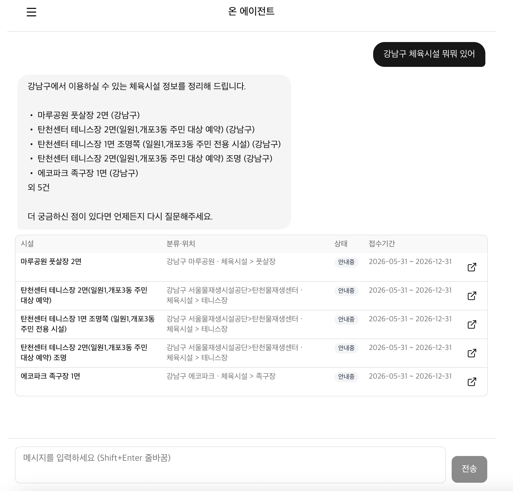

# on-seoul

서울시 공공서비스 예약 데이터를 수집·정제하여 챗봇 안내·알림·지도 탐색 기능을 제공하는 AI Agent 서비스입니다.

---

## 개요

[서울 열린데이터 광장](https://data.seoul.go.kr)의 공공 API를 활용해 서울시 및 산하기관, 자치구의 시설대관 및 예약 정보를 수집하고, 시민이 원하는 시설 예약을 쉽게 찾고 이용할 수 있도록 돕는 서비스입니다.

> 배포된 웹 서비스 **[on-seoul.jazzz.dev](https://on-seoul.jazzz.dev/)** 에서 챗봇을 비롯한 주요 기능을 직접 이용해볼 수 있습니다.

---

## 주요 기능

### 챗봇 기반 예약 안내

> 자연어로 질문하면 SQL 및 벡터 검색으로 관련 시설을 조회하고, 시설명·접수 상태·기간·예약 링크를 카드 형태로 응답합니다.

**카테고리별 예시 질문**

#### 정형 필터 검색

1. 지금 접수 중인 체육시설 알려줘
2. 마포구에서 예약 가능한 시설 보여줘
3. 종로구에서 진행 중인 문화체험 프로그램 알려줘
4. 강동구 무료로 이용할 수 있는 시설 있어?

#### 의미 기반 검색

1. 아이랑 함께 갈 수 있는 체험 프로그램 있어?
2. 주말에 가족이랑 갈 만한 곳 추천해줘
3. 자연 속에서 할 수 있는 활동 찾아줘
4. 실내에서 조용히 즐길 수 있는 프로그램 있어?
5. 한강에서 촬영할 수 있는 장소 예약

#### 정형 + 의미 복합

1. 마포구에서 아이들이 참여할 수 있는 무료 프로그램 알려줘
2. 강서구에서 자연 관찰할 수 있는 프로그램 있어?
3. 종로구에서 가족 단위로 갈 수 있는 박물관 프로그램
4. 성동구에서 초등학생 대상 교육 강좌 알려줘

#### 위치 기반 검색 (MAP - 준비중)

1. 내 주변 1km 이내 체육시설 보여줘
2. 가까운 한강공원 알려줘
3. 근처에서 갈 수 있는 시설을 지도로 보여줘

#### 시설 안내·예약 방법 (준비중)

1. 응봉공원 테니스장은 어떻게 예약해?
2. 서울역사박물관 야주개홀 대관 방법 알려줘

#### 자기교정·Fallback

1. 서울 날씨 어때?
2. 반가워. 너는 어떤 서비스야?

### 개인화 알림

> 알림 스케줄러가 구독 조건별로 변경 이력을 조회하여, 매칭된 항목에 대해 AI 서비스로 메시지 템플릿 생성을 요청하고 Knock을 통해 이메일 또는 SMS로 발송합니다.

| 알림 채널 | 설명 |
|---|---|
| 이메일 | Knock 이메일 워크플로우를 통한 발송 |
| SMS | Knock SMS 워크플로우를 통한 발송 (Twilio 연동) |

### 지도 기반 탐색

> API 응답의 X/Y 좌표를 지도 핀으로 표시하고, 접수 상태를 핀 색상으로 구분합니다. 브라우저 Geolocation API를 통해 현재 위치 기반 반경 탐색도 지원합니다.

- 핀 색상: 접수 중(초록) / 마감(회색) / 대기(주황)
- 필터: 카테고리, 자치구, 접수 상태

---

## 수집 대상 API

서울시 공공서비스 예약과 관련된 5개 API를 주기적으로 수집하여 내부 DB에 저장합니다.

| API명 | 데이터셋 ID | 링크 |
|---|---|---|
| 문화행사 공공서비스 예약 | OA-2269 | [바로가기](https://data.seoul.go.kr/dataList/OA-2269/A/1/datasetView.do) |
| 체육시설 공공서비스 예약 | OA-2266 | [바로가기](https://data.seoul.go.kr/dataList/OA-2266/A/1/datasetView.do) |
| 시설대관 공공서비스 예약 | OA-2267 | [바로가기](https://data.seoul.go.kr/dataList/OA-2267/A/1/datasetView.do) |
| 교육 공공서비스 예약 | OA-2268 | [바로가기](https://data.seoul.go.kr/dataList/OA-2268/A/1/datasetView.do) |
| 진료 공공서비스 예약 | OA-2270 | [바로가기](https://data.seoul.go.kr/dataList/OA-2270/A/1/datasetView.do) |

수집은 APScheduler 기반의 주기적 스케줄링으로 처리하며, 수집된 데이터는 공통 RDB 스키마로 정규화하여 저장합니다.
