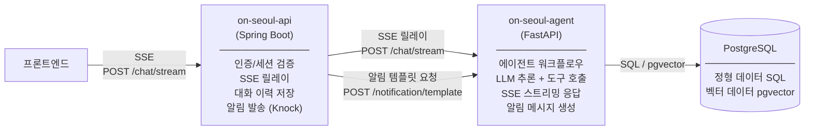
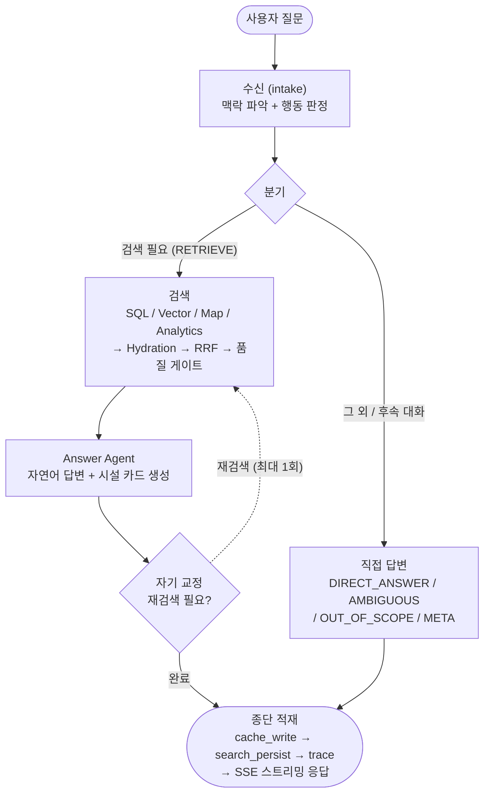

# on-seoul-agent

서울시 공공서비스 예약 정보에 대한 자연어 질의를 처리하는 AI 서비스입니다. FastAPI + LangGraph 기반의 멀티에이전트 워크플로우로 사용자 의도를 분류하고, 적절한 도구를 호출하여 답변을 생성합니다.

---

## 서비스 책임

이 서비스는 **LLM 기반 추론과 데이터 조회**를 담당합니다. 인증, 세션, 데이터 수집, 알림 발송은 `on-seoul-api`(Spring Boot)의 책임입니다.

| 책임 | 설명 |
|---|---|
| 의도 분류 | 사용자 질문을 SQL 조회 / 벡터 검색 / 지도 탐색 / 일반 안내로 분류 |
| 정형 데이터 조회 | PostgreSQL에서 카테고리, 접수 상태, 지역, 날짜 기반 SQL 조회 |
| 의미 검색 | pgvector 임베딩 유사도 기반 시설 검색 |
| 지도 데이터 반환 | earthdistance + cube로 반경 내 시설을 GeoJSON 형식으로 반환 |
| 자연어 답변 생성 | 조회 결과를 시설 카드(이름, 상태, 기간, 예약 링크)로 가공하여 응답 |
| 알림 템플릿 생성 | 예약 서비스의 내용 및 상태 변경 정보를 받아 LLM으로 알림 메시지를 생성하여 반환 (발송은 `on-seoul-api`가 처리) |

---

## 다른 서비스와의 통신



**엔드포인트**

| 엔드포인트 | 호출자 | 설명 |
|---|---|---|
| `POST /chat/stream` | `on-seoul-api` | 사용자 질문을 받아 SSE 스트리밍으로 답변 반환 |
| `POST /notification/template` | `on-seoul-api` | 상태 변경 정보를 받아 LLM으로 알림 메시지 생성 후 반환 |

- **DB 접근**: `on-seoul-agent`가 PostgreSQL에 직접 연결하여 SQL 조회 및 벡터 검색 수행
- **알림 발송**: `on-seoul-api`가 `/notification/template` 응답을 받아 Knock으로 발송(SMS/이메일)
- **대화 이력 저장**: `on-seoul-api`가 스트림 완료 후 질문과 최종 응답을 저장 (이 서비스는 이력을 저장하지 않음)

---

## 에이전트 워크플로우

상위 흐름만 요약합니다. 노드별 상세 토폴로지·엣지 조건·관측 종단 체인은 [docs/ai-agent-design.md](docs/ai-agent-design.md)를 참고하세요.



- **수신 단일화 (intake)**: 한 번의 LLM 호출로 맥락 유형(`turn_kind`)과 행동(`action`)을 함께 판정하고, 직전 결과를 가리키는 지시 참조도 해소합니다. `RETRIEVE`만 검색 경로로, 나머지는 직접 답변으로 분기합니다.
- **후속 대화**: "그중에서"·"방금 그거" 같은 참조는 직전 결과를 재조회(rehydrate)해 설명하고, "그중 무료만" 같은 조건 추가(REFINE)는 직전 검색 구성에 제약을 더해 재검색합니다.
- **자기 교정**: 검색이 0건이면 방향을 바꿔 최대 1회 재검색합니다. (옵션) Retrieval Critic을 켜면 결과가 약할 때(빈약·쏠림) LLM이 재검색/응답 여부를 판단합니다.
- **decision SSE**: 판단 근거(action·routes·user_rationale)를 `decision` 이벤트로 스트리밍하여 투명성을 제공합니다.

### 에이전트 (LLM 추론)

| 에이전트 | 역할 |
|---|---|
| Intake Agent | 맥락 유형(`turn_kind`)과 행동(`action`)을 한 번에 판정하고 지시 참조를 해소 |
| Router Agent | `RETRIEVE`일 때 검색 의도(`intent`: SQL / VECTOR / MAP / ANALYTICS)와 조건을 결정 |
| SQL Agent | sql_search 도구를 호출하여 정형 데이터 조회 |
| Vector Agent | 질의를 정제한 뒤 4채널 하이브리드(vector + bm25 + question) 검색을 RRF로 결합 |
| Analytics Agent | 집계·통계성 질의(ANALYTICS)를 처리 |
| Answer Agent | 조회 결과를 자연어 답변과 시설 카드로 가공. URL 미존재 시 fallback 링크 처리 |
| Retrieval Critic (옵션) | 결과가 약할 때 다음 행동(ANSWER / REPLAN / STOP)을 판단. 기본 비활성 |

### 도구 (룰베이스, LLM 추론 없음)

| 도구 | 설명 |
|---|---|
| sql_search | PostgreSQL 정형 조회 (카테고리, 상태, 지역, 날짜 필터) |
| vector_search | pgvector 임베딩 유사도 검색 (post-filter) |
| question_search | 예상 질문 임베딩 검색, service_id별 dedup (Track C) |
| bm25_search | ParadeDB BM25 전문 검색 (정확 키워드 매칭) |
| map_search | earthdistance + cube 반경 검색, GeoJSON 반환 |
| analytics_search | GROUP BY / DISTINCT 집계 조회 |
| hydrate_services | service_id로 원본 테이블 최신 행 재조회 |
| fetch_detail_content | 운영-상세 답변용 단건 상세 본문 조회 |

---

## 디렉토리 구조

```
on-seoul-agent/
├── main.py                  # FastAPI 앱 진입점
├── pyproject.toml           # 의존성 관리 (uv)
├── routers/
│   ├── chat.py              # POST /chat/stream — SSE 스트리밍 엔드포인트
│   ├── notification.py      # POST /notification/template — 알림 메시지 생성
│   ├── embeddings.py        # 임베딩 관련 엔드포인트
│   └── admin.py             # 캐시 flush 등 운영 엔드포인트
├── agents/
│   ├── graph.py             # LangGraph StateGraph 조립·실행 (조건부 엣지 라우팅)
│   ├── nodes/               # 노드 구현 (intake, planning, retrieval, correction, cache, observability, reference, answer)
│   ├── intake_agent.py      # 맥락 유형(turn_kind) + 행동(action) 판정 + 지시 참조 해소
│   ├── router_agent.py      # RETRIEVE 시 검색 의도(intent)와 조건 결정
│   ├── sql_agent.py         # SQL 조회 에이전트
│   ├── vector_agent.py      # 4채널 하이브리드 검색 (vector + bm25 + question, RRF)
│   ├── analytics_agent.py   # 집계·통계성 질의 처리
│   ├── answer_agent.py      # 답변 생성 에이전트
│   ├── hydration_node.py    # RRF 결과 → 원본 서비스 hydration
│   ├── retrieval_critic.py  # (옵션) 결과 관찰 → 다음 행동 판단
│   └── detail_excerpt.py    # 운영-상세 본문 발췌·정제 (순수 함수)
├── tools/
│   ├── sql_search.py        # PostgreSQL 정형 조회
│   ├── vector_search.py     # pgvector 유사도 검색 (post-filter)
│   ├── question_search.py   # 예상 질문 임베딩 검색, service_id별 dedup (Track C)
│   ├── bm25_search.py       # ParadeDB BM25 전문 검색
│   ├── map_search.py        # 반경 검색 + GeoJSON 반환
│   ├── analytics_search.py  # 집계 조회 (GROUP BY / DISTINCT)
│   ├── hydrate_services.py  # service_id 원본 재조회
│   ├── fetch_detail_content.py  # 운영-상세 단건 본문 조회
│   └── tokenizer.py         # Kiwi(kiwipiepy) 형태소 분석기 (BM25 토크나이징)
├── llm/
│   ├── client.py            # LLM API 호출 추상화 (Gemini / GPT)
│   ├── embedder.py          # 텍스트 → 벡터 변환
│   ├── extractor.py         # 상세내용 구조화 추출 (임베딩 파이프라인)
│   ├── hyqe.py              # HyQE 예상 질문 생성
│   └── embedding_config.py  # 임베딩 도메인 상수
├── schemas/
│   ├── state.py             # AgentState (LangGraph 공유 상태)
│   ├── intake.py            # Intake 출력 스키마 (turn_kind / action 등)
│   ├── critic.py            # Retrieval Critic 판단 스키마
│   ├── search.py            # ChannelData / SearchKind / SearchChannel
│   ├── events.py            # SSE 이벤트 타입
│   └── chat.py              # ChatRequest / ChatResponse
├── core/
│   ├── config.py            # pydantic-settings 환경변수 관리
│   ├── database.py          # async SQLAlchemy 세션
│   ├── concurrency.py       # 벡터 채널 글로벌 세마포어
│   ├── cache.py             # 응답/정제 질의 캐시 (Redis)
│   └── rrf.py               # 가중 RRF (reciprocal_rank_fusion)
├── scripts/
│   ├── embed_metadata.py    # 시설 메타데이터 임베딩 배치 적재
│   ├── tracks/              # 트랙 A/B/C 임베딩 모듈
│   ├── eval/                # recall 평가 하네스 (봉인 평가셋)
│   └── ddl/                 # 테이블 DDL — service_embeddings, chat_search 등
└── middleware/
    └── metrics.py           # 응답시간 측정
```

---

## 기술 스택

| 영역 | 기술 |
|---|---|
| 프레임워크 | FastAPI |
| 워크플로우 오케스트레이션 | LangGraph (StateGraph) |
| LLM | Gemini 2.0 Flash (기본) / GPT-4o-mini (폴백) |
| DB | PostgreSQL + pgvector (async SQLAlchemy) |
| 캐시 | Redis |
| 패키지 관리 | uv |
| 테스트 | pytest + pytest-asyncio |
| 린터/포맷터 | ruff |
| Python | 3.13+ |

---

## 실행 방법

```bash
# 의존성 설치
uv sync

# 개발 서버 실행
uv run uvicorn main:app --reload

# 헬스체크
curl http://localhost:8000/health

# 테스트
uv run pytest

# 린트 & 포맷
uv run ruff check .
uv run ruff format .
```
