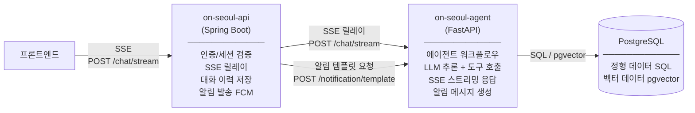
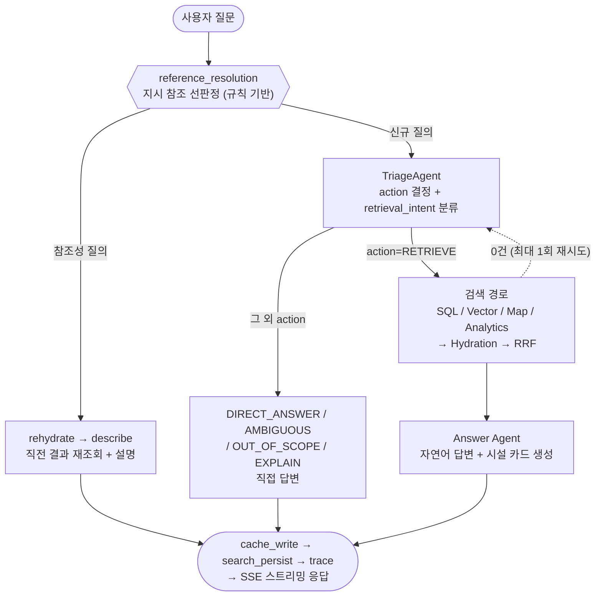

# on-seoul-agent

서울시 공공서비스 예약 정보에 대한 자연어 질의를 처리하는 AI 서비스입니다. FastAPI + LangGraph 기반의 멀티에이전트 오케스트레이션으로 사용자 의도를 분류하고, 적절한 도구를 호출하여 답변을 생성합니다.

---

## 서비스 책임

이 서비스는 **LLM 기반 추론과 데이터 조회**를 담당합니다. 인증, 세션, 데이터 수집, 알림 발송은 `on-seoul-api`(Spring Boot)의 책임입니다.

| 책임 | 설명 |
|---|---|
| 의도 분류 | 사용자 질문을 SQL 조회 / 벡터 검색 / 지도 탐색 / 일반 안내로 분류 |
| 정형 데이터 조회 | PostgreSQL에서 카테고리, 접수 상태, 지역, 날짜 기반 SQL 조회 |
| 의미 검색 | pgvector 임베딩 유사도 기반 시설 검색 |
| 지도 데이터 반환 | earthdistance + cube로 반경 내 시설을 GeoJSON 형식으로 반환 |
| 자연어 답변 생성 | 조회 결과를 시설 카드(이름, 상태, 기간, 예약 링크)로 가공하여 응답 |
| 알림 템플릿 생성 | 예약 서비스의 내용 및 상태 변경 정보를 받아 LLM으로 알림 메시지를 생성하여 반환 (발송은 `on-seoul-api`가 처리) |

---

## 다른 서비스와의 통신



**엔드포인트**

| 엔드포인트 | 호출자 | 설명 |
|---|---|---|
| `POST /chat/stream` | `on-seoul-api` | 사용자 질문을 받아 SSE 스트리밍으로 답변 반환 |
| `POST /notification/template` | `on-seoul-api` | 상태 변경 정보를 받아 LLM으로 알림 메시지 생성 후 반환 |

- **DB 접근**: `on-seoul-agent`가 PostgreSQL에 직접 연결하여 SQL 조회 및 벡터 검색 수행
- **알림 발송**: `on-seoul-api`가 `/notification/template` 응답을 받아 FCM으로 직접 발송
- **대화 이력 저장**: `on-seoul-api`가 스트림 완료 후 질문과 최종 응답을 저장 (이 서비스는 이력을 저장하지 않음)

---

## 에이전트 워크플로우

상위 흐름만 요약합니다. 노드별 상세 토폴로지·엣지 조건·관측 종단 체인은 [docs/ai-agent-design.md](docs/ai-agent-design.md)를 참고하세요.



- **action 2축 분리**: TriageAgent는 `action`(RETRIEVE / DIRECT_ANSWER / AMBIGUOUS / OUT_OF_SCOPE / EXPLAIN)과 `retrieval_intent`(SQL_SEARCH / VECTOR_SEARCH / MAP / ANALYTICS)를 함께 판정합니다. RETRIEVE만 검색 경로로, 나머지는 직접 답변으로 분기합니다.
- **참조 해소**: "그중에서", "방금 그거" 같은 지시 참조성 질의는 규칙 기반 선판정으로 직전 결과를 재조회(rehydrate)한 뒤 설명(describe)합니다.
- **decision SSE**: TriageAgent 분류 직후 판단 근거(action·routes·user_rationale)를 `decision` 이벤트로 스트리밍하여 투명성을 제공합니다.

### 에이전트 (LLM 추론)

| 에이전트 | 역할 |
|---|---|
| Triage Agent | action(5종)과 retrieval_intent를 2축으로 분류하고 다음 경로를 결정. RouterAgent를 대체 |
| SQL Agent | sql_search 도구를 호출하여 정형 데이터 조회 |
| Vector Agent | 질의를 정제한 뒤 vector_search / bm25_search를 호출하여 하이브리드 유사도 검색 |
| Analytics Agent | 집계·통계성 질의(ANALYTICS)를 처리 |
| Answer Agent | 조회 결과를 자연어 답변과 시설 카드로 가공. URL 미존재 시 fallback 링크 처리 |

### 도구 (룰베이스, LLM 추론 없음)

| 도구 | 설명 |
|---|---|
| sql_search | PostgreSQL 정형 조회 (카테고리, 상태, 지역, 날짜 필터) |
| vector_search | pgvector 임베딩 유사도 검색 |
| question_search | `on_ai.service_embeddings WHERE row_kind='question'` — 예상 질문 임베딩 검색, service_id별 dedup |
| map_search | earthdistance + cube 반경 검색, GeoJSON 반환 |

---

## 디렉토리 구조

```
on-seoul-agent/
├── main.py                  # FastAPI 앱 진입점
├── pyproject.toml           # 의존성 관리 (uv)
├── routers/
│   └── chat.py              # POST /chat/stream — SSE 스트리밍 엔드포인트
├── agents/
│   ├── graph.py             # LangGraph StateGraph 조립·실행 (조건부 엣지 라우팅)
│   ├── nodes.py             # GraphNodes — 노드·엣지 구현 본체
│   ├── triage_agent.py      # action 결정 + retrieval_intent 분류 (RouterAgent 대체)
│   ├── router_agent.py      # 의도 분류 (하위호환 alias)
│   ├── _reference_resolution.py  # 지시 참조 선판정 (규칙 기반, LLM 미사용)
│   ├── hydration_node.py    # RRF 결과 → 원본 서비스 hydration
│   ├── sql_agent.py         # SQL 조회 에이전트
│   ├── vector_agent.py      # 벡터 검색 에이전트 (BM25 + vector 하이브리드)
│   ├── analytics_agent.py   # 집계·통계성 질의 처리 에이전트
│   └── answer_agent.py      # 답변 생성 에이전트
├── tools/
│   ├── sql_search.py        # PostgreSQL 정형 조회
│   ├── vector_search.py     # pgvector 유사도 검색 (post-filter)
│   ├── question_search.py   # 예상 질문 임베딩 검색, service_id별 dedup (Track C)
│   ├── bm25_search.py       # ParadeDB BM25 전문 검색
│   ├── tokenizer.py         # Kiwi(kiwipiepy) 형태소 분석기 (BM25 쿼리 토크나이징)
│   └── map_search.py        # 반경 검색 + GeoJSON 반환
├── llm/
│   ├── client.py            # LLM API 호출 추상화 (Gemini / GPT)
│   ├── embedder.py          # 텍스트 → 벡터 변환
│   └── embedding_config.py  # 임베딩 도메인 상수
├── schemas/
│   ├── state.py             # AgentState (LangGraph StateGraph 공유 상태)
│   ├── search.py            # ChannelData / SearchKind / SearchChannel 상수, search_channels_reducer
│   ├── events.py            # SSE 이벤트 타입
│   └── chat.py              # ChatRequest / ChatResponse
├── core/
│   ├── config.py            # pydantic-settings 환경변수 관리
│   ├── database.py          # async SQLAlchemy 세션
│   └── rrf.py               # 가중 RRF (reciprocal_rank_fusion)
├── scripts/
│   ├── embed_metadata.py    # 시설 메타데이터 임베딩 배치 적재
│   ├── ddl/                 # 테이블 DDL — service_embeddings, chat_search 등
│   └── ddl_chat_entities.sql # chat_agent_traces / chat_search_* include 진입점
└── middleware/
    └── metrics.py           # 응답시간 측정
```

---

## 기술 스택

| 영역 | 기술 |
|---|---|
| 프레임워크 | FastAPI |
| 에이전트 오케스트레이션 | LangGraph (StateGraph) |
| LLM | Gemini 2.0 Flash (기본) / GPT-4o-mini (폴백) |
| DB | PostgreSQL + pgvector (async SQLAlchemy) |
| 캐시 | Redis |
| 패키지 관리 | uv |
| 테스트 | pytest + pytest-asyncio |
| 린터/포맷터 | ruff |
| Python | 3.13+ |

---

## 실행 방법

```bash
# 의존성 설치
uv sync

# 개발 서버 실행
uv run uvicorn main:app --reload

# 헬스체크
curl http://localhost:8000/health

# 테스트
uv run pytest

# 린트 & 포맷
uv run ruff check .
uv run ruff format .
```
