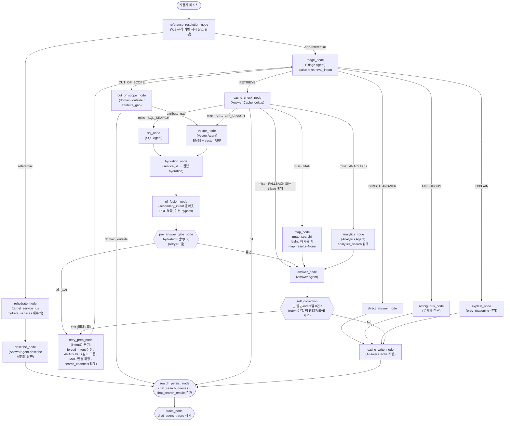

# AI 에이전트 설계

> 이 페이지는 사용자 질문이 어떤 과정을 거쳐 응답을 생성하는지, on-seoul-agent의 에이전트/도구/그래프 구조를 중심으로 설명한다.

---

## 1. 개요

`on-seoul-agent`는 사용자의 자연어 질문을 받아, 의도를 분류하고 적절한 검색 도구를 호출한 뒤, 자연어 답변과 시설 카드를 생성하는 **멀티 에이전트** 서비스이다. LangGraph `StateGraph` 를 기반으로 노드와 조건부 엣지로 조립된다.

| 구성 요소 | 위치 | 역할 |
|---|---|---|
| **에이전트** (Agent) | `agents/` | 트리아지(행동·의도 결정), 파라미터 추출, 답변 생성 |
| **도구** (Tool) | `tools/` | DB 조회 추상화 (SQL / 벡터 / BM25 / 질문 / 지도 / 집계 / hydration) |
| **그래프** | `agents/graph.py` | LangGraph `StateGraph` 노드·엣지 조립 및 실행 |

> **W1/W2/W3 반영(2026-06-06)**: 단일 `Router Agent`가 결정하던 라우팅이 `Triage Agent`로 확장되어 **action(행동) × retrieval_intent(검색 방식)** 2축으로 분리되었다. START 직후 규칙 기반 **참조 해소(reference resolution)** 게이트가 추가되어 직전 턴 시설을 가리키는 지시 참조를 우회 경로(rehydrate → describe)로 처리한다. triage 완료 직후에는 판단 근거를 담은 `decision` SSE 이벤트를 1회 방출한다.

---

## 2. 전체 흐름



각 노드는 공유 상태인 **`AgentState`** 를 입력받아 부분 업데이트 dict를 반환한다. LangGraph가 상태 병합을 담당하므로 노드 내부에서 직접 변이하지 않는다. 그래프 전체에는 super-step을 22로 제한(`recursion_limit=22`)하고 재시도는 1회 캡(`retry_count==0`)을 둬 무한 사이클을 방지한다. W2 최악 경로(RETRIEVE + 1회 재시도)는 18 super-step이며 여유 4를 더해 22로 설정한다.

> **참조 해소 경로(W1)**: `reference_resolution_node`가 `prev_entities`를 근거로 현재 메시지가 직전 턴 시설을 가리키는 지시 참조인지 규칙 기반(LLM 미사용)으로 판정한다. referential이면 `rehydrate_node → describe_node`로 검색 경로를 우회하고, 비참조이면 `triage_node`로 진행한다(기존 흐름, 하위호환).

> **2축 분리(W2)**: `triage_node`는 `action`(RETRIEVE / DIRECT_ANSWER / AMBIGUOUS / OUT_OF_SCOPE / EXPLAIN)과 `retrieval_intent`(RETRIEVE일 때만)를 직교 산출한다. RETRIEVE만 기존 검색 흐름으로 진입하고, 나머지 4종은 각자의 action 노드에서 검색 없이 답변을 생성한다. `OUT_OF_SCOPE/attribute_gap`만 예외적으로 `vector_node`로 합류하여 시설 식별 검색을 수행한다.

> **종단 체인 일관성**: cache hit·참조 해소·비-RETRIEVE action 경로 모두 `search_persist_node`를 경유한다. 빈 `search_channels`에서는 즉시 skip되므로 오버헤드는 없으나, 명시적으로 통과시켜 "cache_write → search_persist → trace"의 종단 체인 형태를 항상 동일하게 유지한다.

---

## 3. 에이전트 (Agents)

### 3-1. Triage Agent — 행동·의도 결정 (2축 분리, W2)

`TriageAgent`(`agents/triage_agent.py`)는 기존 `RouterAgent`를 대체·포함하며, LCEL `llm.with_structured_output(TriageOutput)` 으로 사용자 메시지를 **2축**으로 분류한다.

- **action 축** — `RETRIEVE` / `DIRECT_ANSWER` / `AMBIGUOUS` / `OUT_OF_SCOPE` / `EXPLAIN`
- **retrieval_intent 축** — `primary_intent`(`SQL_SEARCH` / `VECTOR_SEARCH` / `MAP` / `ANALYTICS`), action=RETRIEVE일 때만 채움

| 입출력 | 필드 |
|---|---|
| **in** | `message`, `history` (직전 N턴, 선택), `prev_reasoning` (EXPLAIN 판정용) |
| **out** | `action`, `primary_intent`, `secondary_intent`, `out_of_scope_type`, `user_rationale`, `reasoning`(CoT, 관측 전용), `refined_query`, `max_class_name`, `area_name`, `service_status`, `payment_type`, `vector_sub_intent` |

하위호환을 위해 `TriageOutput.model_post_init`이 `intent` 필드를 동기화한다 — action=RETRIEVE이면 `intent = primary_intent`, 그 외에는 `intent = FALLBACK`. 따라서 `intent`를 읽는 기존 코드가 그대로 동작한다.

- `secondary_intent`는 SQL↔VECTOR 경계가 모호할 때만 채워지며 `SQL_SEARCH`/`VECTOR_SEARCH`만 허용한다(`enable_secondary_intent=True`일 때 팬아웃 트리거).
- `out_of_scope_type`은 action=OUT_OF_SCOPE일 때 `domain_outside`(즉시 거절) 또는 `attribute_gap`(시설 식별 검색 필요)로 분기한다.
- `user_rationale`은 사용자 노출용 판단 근거 1문장으로, `decision` SSE 이벤트(§3-7, W3)에 포함된다.
- `max_class_name` / `area_name` / `service_status` / `payment_type` / `vector_sub_intent`는 `field_validator`로 도메인 화이트리스트(자치구 25종, 상태 5종, 카테고리 5종, `payment_type`은 `"무료"`/`"유료"` 정규값) 밖 값을 `None`으로 정규화한다. `payment_type`은 SQL_SEARCH 경로에서 `sql_search`의 결제 유형 필터로 전달되며(유료는 `"유료%"` 접두 매칭), `cache_check` 키에도 포함된다. history 컨텍스트 블록은 `router_agent.build_context_block`을 재사용한다.

**forced_intent honor**: `retry_prep_node`가 방향성 재시도로 `forced_intent`를 강제하면 `triage_node`는 LLM 재분류를 skip하고 그 intent를 `action=RETRIEVE`로 반환하며 즉시 `forced_intent=None`으로 소비한다(1회성).

**예외 처리**: `triage_node` 내부에서 예외가 발생하면 `error`(예외 메시지)와 `answer`(fallback 안내 메시지)를 state에 주입하고 `action=DIRECT_ANSWER`로 설정한 뒤 `node_path`에 `"triage_error"`를 append한다. 후속 self-correction 엣지는 비-RETRIEVE action이므로 즉시 종단 체인으로 종료한다(무한루프 방지).

> `RouterAgent`(`router_agent.py`)는 명시 주입 시 하위호환 `router_node` alias 경로로만 사용된다. 프로덕션에서는 `AgentGraph()`가 항상 `TriageAgent()`를 기본 주입한다.

### 3-1a. 참조 해소 — reference_resolution / rehydrate / describe (W1)

`reference_resolution_node`는 START 직후 실행되어 현재 메시지가 직전 턴 결과 엔티티를 가리키는 **지시 참조**인지 규칙 기반(LLM 미사용, `agents/_reference_resolution.py`)으로 판정한다. 신호 3종을 사용한다.

1. **지시대명사** — "이곳/저기/그거/여기/방금/위에/해당" 등 (공백 제거 후 부분 문자열 매칭).
2. **서수** — 한글("첫번째"~"열번째") + 아라비아("3번째", 단서 동반 시 "1번"). 0-base 인덱스로 변환.
3. **직전 라벨 부분일치** — `prev_entities[].label`의 변별 토큰이 메시지에 등장. 일반 카테고리 토큰("수영장"·"센터" 등)은 과잉 매칭 방지를 위해 제외한다.

게이트: `prev_entities`가 비어 있으면 무조건 non-referential(`target_service_ids=None`)이므로 기존 흐름과 100% 하위호환된다. 다중 참조("1번이랑 3번")는 `prev_entities` 인덱스 오름차순으로 정규화하여 복수 바인딩한다.

- referential → `target_service_ids` 바인딩 후 `rehydrate_node`(검색 우회).
- non-referential → `triage_node`(기존 흐름).

`rehydrate_node`는 정체성(`service_id`)만 이어받고 사실(상태·일정)은 `hydrate_services(target_service_ids)`로 최신 원본에서 재조회한다(스냅샷 캐싱 금지 — staleness 위험). 재-hydrate 0건(soft-delete/마감)이면 `hydrated_services=[]`로 둔다. 이어 `describe_node`가 `AnswerAgent.describe()`로 예약 카드 템플릿이 아닌 "어떤 곳인지" 설명형 답변을 생성하고, 0건이면 정직한 안내 + 재검색 제안을 반환한다(환각·빈 카드 금지).

### 3-2. SQL Agent — 정형 데이터 조회

LLM이 SQL을 직접 생성하지 않는다. 메시지에서 필터 파라미터만 구조화 출력으로 추출한 뒤 `sql_search` 도구를 호출한다.

| 입출력 | 필드 |
|---|---|
| **in** | `message` |
| **out** | `sql_results` |

### 3-3. Vector Agent — 의미 기반 검색 (4채널 RRF 하이브리드)

> Task 1~6에서 4채널 순차 실행 + RRF 결합으로 확장되었다.

1. **질의 정제** — LLM으로 사용자 질의를 벡터 검색용 문장으로 정제하고, post-filter용 파라미터(`max_class_name`, `area_name`, `service_status`)와 `vector_sub_intent`를 함께 추출한다.
2. **4채널 순차 실행 (ai_session)** — asyncpg 단일 세션 제약으로 `gather` 대신 순차 실행한다.
   - **Track A**: `vector_search(row_kind="identity")` — 시설 신원 임베딩, post-filter 적용
   - **Track B**: `vector_search(row_kind="summary")` — 자연어 요약 임베딩, post-filter 미적용
   - **Track C**: `question_search()` — 예상 질문 임베딩, `service_id`별 dedup
   - **BM25**: `bm25_search()` — `tools/tokenizer.py` (Kiwi(kiwipiepy) 형태소 분석 + `DOMAIN_TOKENS`)로 토큰화 후 호출. 제안3에서 토큰화는 `atokenize_query()`로 `asyncio.to_thread()` 오프로드된다(고QPS 이벤트 루프 블로킹 방지)
3. **RRF 결합** — `core/rrf.py`의 `reciprocal_rank_fusion`으로 4채널 결과를 통합한다. Phase 1은 `rrf_unweighted_baseline=True` (모든 채널 가중치 1.0).
4. `vector_results`에 RRF 통합 결과(메타데이터 + `service_id` + `rrf_score`)를 저장한다.

> **Hydration 분리(W2)**: 원본 hydration은 `VectorAgent.search()` 내부가 아니라 후속 `hydration_node`(별도 그래프 노드)가 담당한다. `vector_node`는 `vector_results`(메타데이터·`service_id`·`rrf_score`)만 채우고, `hydration_node`가 `service_id`로 `hydrate_services`를 호출하여 `hydrated_services` 슬롯에 최신 원본을 채운다. `AnswerAgent`는 검색 경로에 무관하게 `hydrated_services` 단일 슬롯을 사용한다. `sql_node` 경로는 `sql_search`가 이미 원본 행을 반환하므로 `hydration_node`를 통과한다.

| 입출력 | 필드 |
|---|---|
| **in** | `message`, `vector_sub_intent` |
| **out** | `refined_query`, `vector_results` |

> 4채널 검색은 `ai_session`(채널별 독립 세션, `asyncio.gather` 병렬), 원본 조회는 `hydration_node`의 `data_session`으로 분리되어 있다.

**BM25 도입 배경**: ParadeDB Lindera의 `user_dictionary`는 SQL API 레벨에서 지원되지 않아 커스텀 사전 적용에 소스 빌드가 필요했다. 이를 우회하기 위해 Python 레이어(`tools/tokenizer.py`)에서 Kiwi(kiwipiepy)로 사전 토크나이징한 뒤 BM25 쿼리 조건을 구성한다. 도메인 용어(예: "따릉이", "한강공원")는 `DOMAIN_TOKENS` 화이트리스트로 보존된다.

> **토크나이저 2계층 구조**: 토크나이저는 역할이 다른 두 계층으로 나뉜다. ① **색인/매칭 계층** — DB BM25 인덱스(`scripts/ddl/service_embeddings.sql`)는 ParadeDB `korean_lindera`(KoDic)로 색인하고, `col @@@ 'token'` 평가 시 전달된 토큰도 동일 `korean_lindera`로 재분석해 매칭하므로 색인↔매칭 토크나이저는 일치한다. ② **쿼리 이해 계층** — Python(`tools/tokenizer.py`)은 Kiwi(kiwipiepy)로 의미 품사만 추출해 BM25에 보낼 검색어를 선별한다(노이즈 감소). 원안은 Python 측도 `lindera-py`였으나 PyPI 미등록으로 설치 불가하여 문맥 기반 분석이 더 정교한 Kiwi로 교체했다. 두 계층은 경쟁이 아니라 역할 분리다. 상세는 [`docs/hybrid-search-strategy.md`](hybrid-search-strategy.md#토크나이저-2계층-kiwi-쿼리-이해--korean_lindera-색인-매칭) 참조.

### 3-4. Analytics Agent — 집계 질의 처리

LLM이 SQL을 직접 생성하지 않는다. 메시지에서 집계 파라미터(group_by, metric, keyword 등)를 구조화 출력으로 추출한 뒤 `analytics_search` 도구를 호출한다. hydration 단계는 거치지 않는다.

| 입출력 | 필드 |
|---|---|
| **in** | `message`, `max_class_name`, `area_name`, `service_status` |
| **out** | `analytics_results`, `analytics_group_by`, `analytics_metric`, `analytics_keyword` |

### 3-5. Answer Agent — 답변 생성

검색 결과를 자연어 답변 + 시설 카드로 가공한다.

| 입출력 | 필드 |
|---|---|
| **in** | `message`, `intent`, `sql_results`, `vector_results`, `map_results`, `title_needed` |
| **out** | `answer`, `title` (`title_needed=True` 일 때) |

특이사항:

- `sql_results` / `vector_results` / `map_results` / `analytics_results` 를 intent별로 분기하여 LLM에 전달한다.
- `service_url` 이 없으면 `https://yeyak.seoul.go.kr` 로 fallback한다.
- `title_needed=True` 이면 대화 제목(10자 이내)을 별도 LLM 호출로 생성한다.
- 입력 state에 이미 `error` + `answer` 가 모두 채워져 있으면(triage 예외 fast-path) 추가 LLM 호출 없이 즉시 반환한다.

**2-tier 프롬프트 조립 구조:**

- **Tier 1 (정적 조립)**: MAP / ANALYTICS / FALLBACK 프롬프트는 `__init__` 시 1회 조립되어 `_static_prompts` dict에 캐시된다. 실행 경로마다 프롬프트 객체를 재생성하지 않는다.
- **Tier 2 (런타임 조립)**: 카드형(SQL / VECTOR) 프롬프트는 매 호출마다 조건부 절을 코드로 판단해 조합한다. 접수중 여부, 자치구 명시 여부에 따라 해당 절을 포함하거나 제외하여 LLM 컨텍스트를 최소화한다.
- ANALYTICS / FALLBACK intent는 `service_cards=[]`를 반환한다 — 집계/안내 답변은 카드 UI를 사용하지 않는다.

### 3-6. IntentType 분류 기준

| IntentType | 분류 기준 | 예시 | 비고 |
|---|---|---|---|
| `SQL_SEARCH` | 카테고리·자치구·접수 상태·날짜 등 정형 조건 | "지금 접수 중인 수영장" | 개별 목록 반환 |
| `VECTOR_SEARCH` | 키워드·의미 기반 유사 시설 탐색 | "아이랑 체험할 수 있는 곳" | `vector_sub_intent`: `identification` / `detail` / `semantic` |
| `MAP` | 지도·위치·반경 탐색 | "내 주변 500m 이내 체육관" | GeoJSON 반환 |
| `ANALYTICS` | 개수·분포·종류 등 집계/요약 질의 | "강남구에 체육시설이 몇 개야?" | 통계/카운트 반환. hydration 생략. SQL_SEARCH(개별 목록)와 구별 |
| `FALLBACK` | 인사·기능 문의 등 그 외 | "어떤 서비스를 제공하나요?" | action이 비-RETRIEVE일 때 동기화 값. service_cards=[] |

> action=RETRIEVE일 때만 `intent`가 위 검색 4종 중 하나로 채워진다. 비-RETRIEVE action(DIRECT_ANSWER/AMBIGUOUS/OUT_OF_SCOPE/EXPLAIN)은 `intent=FALLBACK`으로 동기화되고 §3-7의 action 노드로 라우팅된다.

### 3-7. action 노드 (W2) + decision SSE 이벤트 (W3)

action=RETRIEVE를 제외한 4종은 `triage_node` 직후 `route_by_action` 분기로 각자의 노드에 도달한다. 모두 검색 없이 답변을 생성하고 종단 체인으로 진행한다.

| action | 노드 | 동작 |
|---|---|---|
| `DIRECT_ANSWER` | `direct_answer_node` | DB 없이 `AnswerAgent.answer()`로 직접 응답 (`intent=FALLBACK` 분기). 기존 FALLBACK 안내문 대체 |
| `AMBIGUOUS` | `ambiguous_node` | 명확화 질문 1개 생성. `user_rationale`이 있으면 그것을, 없으면 기본 안내를 답변으로 사용 |
| `OUT_OF_SCOPE` | `out_of_scope_node` | `domain_outside` → 즉시 거절 메시지(검색 없음). `attribute_gap` → `intent=VECTOR_SEARCH` + `vector_sub_intent=identification` 세팅 후 `vector_node`로 합류 |
| `EXPLAIN` | `explain_node` | `prev_reasoning`으로 판단 근거 설명. `prev_reasoning`이 없으면 `direct_answer_node`로 폴백 |

**decision SSE 이벤트 (W3)**: `triage_node`가 LLM 분류를 실제 수행한 경우(`user_rationale` 존재), `stream()`이 triage 완료 직후 `DecisionEvent`(`schemas/events.py`)를 **1회** 방출한다.

| 필드 | 값 |
|---|---|
| `event` | `"decision"` (고정) |
| `action` | TriageAgent가 결정한 action 5종 중 하나 |
| `routes` | `[primary_intent, secondary_intent]`에서 None 제거한 리스트. RETRIEVE 외에는 `[]` |
| `user_rationale` | `sanitize_user_rationale()`로 정제된 판단 근거 1문장 (내부 `__` 식별자 패턴 줄 제거 + 최대 200자 절단) |
| `sources` | 검색 전 단계라 항상 `[]` |

`forced_intent` 재시도 경로와 하위호환 `router_node` alias 경로는 `user_rationale`을 설정하지 않으므로 decision 이벤트를 방출하지 않는다.

---

## 4. 도구 (Tools)

에이전트는 SQL을 직접 작성하거나 벡터 연산을 직접 다루지 않는다. DB 조회는 아래 도구로 위임된다: `sql_search`, `vector_search`, `bm25_search`, `question_search`, `hydrate_services`, `map_search`, `analytics_search`. 토큰화 유틸은 `tools/tokenizer.py`(W1/W2가 신규 도구를 추가하진 않음).

### 4-1. `sql_search` — 정형 필터 조회

`on_data.public_service_reservations` 테이블을 파라미터화 SQL로 조회한다. 모든 필터 값은 bind 파라미터로 전달하므로 SQL Injection 위험이 없다.

| 파라미터 | 설명 |
|---|---|
| `max_class_name` | 대분류 카테고리 (체육시설·문화체험·공간시설·교육강좌·진료복지) |
| `area_name` | 서울 자치구 (예: 마포구) |
| `service_status` | 예약 상태 (접수중·예약마감·접수종료·예약일시중지·안내중) |
| `keyword` | 시설명·장소명 키워드 (`%keyword%` ILIKE) |
| `top_k` | 최대 반환 건수 (기본값: 10) |

### 4-2. `vector_search` — 의미 기반 유사도 검색 (post-filter)

전체 임베딩에서 유사도 상위 `scan_k`(`top_k × SCAN_K_MULTIPLIER`)를 먼저 뽑은 뒤, 서브쿼리 외부에서 `max_class_name`, `area_name`, `service_status` 를 post-filter로 적용한다.

**Post-filter를 채택한 이유 (Phase 15)**: pgvector HNSW 인덱스는 WHERE 조건과 동시 동작하지 않아, pre-filter를 적용하면 인덱스를 우회해 sequential scan으로 빠진다. 전체를 HNSW로 먼저 검색하고 후처리로 필터링하는 쪽이 인덱스 효율과 검색 품질 모두 유리하다. `scan_k`를 충분히 크게 잡아 필터 탈락으로 인한 결과 부족을 완충한다.

| 파라미터 | 설명 |
|---|---|
| `query_vector` | 쿼리 임베딩 벡터 |
| `max_class_name`, `area_name`, `service_status` | post-filter (None이면 미적용) |
| `top_k` | 최종 반환 건수 (기본값: 10) |
| `min_similarity` | 코사인 유사도 하한 (기본값 0.6) |

### 4-3. `bm25_search` — ParadeDB 전문 검색 (Phase 14 신설)

`service_embeddings` 테이블의 ParadeDB BM25 인덱스를 사용해 한국어 형태소 기반 키워드 매칭을 수행한다. 토큰 배열은 Python 레이어(`tools/tokenizer.py`)에서 Kiwi(kiwipiepy)로 사전 분해한 결과를 사용한다.

| 파라미터 | 설명 |
|---|---|
| `tokens` | `llm/tokenizer.py` 로 사전 분해된 토큰 배열 |
| `top_k` | 반환 건수 (기본값: 10) |

반환: `(service_id, bm25_score)` 목록. Vector Agent에서 vector 결과와 RRF로 결합된다.

### 4-3.5. `hydrate_services` — 검색 결과 원본 hydration (Phase 18 신설)

RRF 결합 후 추출한 `service_id` 리스트로 `public_service_reservations`에서 최신 원본 행을 조회한다. 임베딩 metadata의 stale 필드를 우회하여 답변 정확도를 보장한다.

| 파라미터 | 설명 |
|---|---|
| `session` | `on_data_reader` 계정 AsyncSession (SELECT 전용) |
| `service_ids` | 검색 순위 순서대로 정렬된 `service_id` 리스트 |

반환: 입력 순서를 유지한 원본 행 리스트. 원본에 없거나 soft-delete된 service_id는 자동 제외. 스키마는 `sql_search` 와 동일. 컬럼 목록은 `docs/tools/hydrate_services.md` 를 참조한다.

### 4-4. `map_search` — 위치 기반 반경 검색

PostgreSQL `earthdistance` + `cube` 확장으로 사용자 위치(위도·경도) 기준 반경 내 시설을 거리 오름차순으로 조회하고 GeoJSON FeatureCollection으로 반환한다. lat/lng 미전송 시 FALLBACK으로 대체된다.

| 파라미터 | 설명 |
|---|---|
| `user_lat`, `user_lng` | 기준점 위도·경도 |
| `radius_m` | 검색 반경 (미터, 기본값: 1000) |
| `top_k` | 최대 반환 건수 (기본값: 20) |

반환값: `GeoJSON FeatureCollection` — 각 Feature의 `properties` 에 시설 정보와 `distance_m` 포함.

### 4-5. `analytics_search` — 집계/분포 조회

`on_data.public_service_reservations` 테이블에서 GROUP BY COUNT 또는 SELECT DISTINCT 집계를 실행한다. LLM이 SQL을 생성하지 않으며, 컬럼명은 화이트리스트 dict 값만 f-string으로 삽입하여 SQL Injection을 원천 차단한다. 필터 값과 top_k는 전부 bind 파라미터로 처리한다.

| 파라미터 | 설명 |
|---|---|
| `group_by` | 집계 차원. 허용값: `area_name` / `max_class_name` / `min_class_name` / `service_status` |
| `metric` | 집계 방식. `count`(건수 집계) 또는 `distinct`(고유값 목록) |
| `max_class_name` | 필터: 대분류 카테고리. None이면 미적용 |
| `area_name` | 필터: 서울 자치구. None이면 미적용 |
| `service_status` | 필터: 예약 상태. None이면 미적용 |
| `keyword` | 필터: 시설명·장소명 키워드 (`%keyword%` ILIKE). None이면 미적용 |
| `top_k` | 최대 반환 건수 (기본값: 25) |

반환: `metric=count` → `[{"group_value": ..., "count": ...}]`, `metric=distinct` → `[{"group_value": ...}]`. 결과가 없으면 빈 리스트.

`on_data_reader`(SELECT 전용) 세션을 사용한다. 호출처: `AnalyticsAgent` (`agents/analytics_agent.py`).

### 4-6. 도구 선택 기준

| 상황 | 도구 |
|---|---|
| 카테고리·지역·상태·키워드로 정형 필터링 | `sql_search` |
| 자연어 의미 기반 유사도 검색 | `vector_search` + `bm25_search` (RRF 결합) |
| 사용자 위치 기준 반경 내 시설 탐색 | `map_search` |
| 개수·분포·종류 등 집계/요약 질의 | `analytics_search` |

---

## 5. 공유 상태 — AgentState

에이전트 간 데이터는 `AgentState` (TypedDict)로 흐른다. LangGraph가 부분 업데이트 dict를 자동으로 병합한다.

| 필드 | 작성 주체 | 설명 |
|---|---|---|
| `room_id`, `message_id`, `message`, `title_needed` | 호출자 | 입력 |
| `user_lat`, `user_lng` | 호출자 | MAP intent 용 위치 |
| `history` | 호출자 | 직전 N턴 대화 이력. triage가 맥락으로 활용 |
| `prev_entities` | 호출자(W1) | 직전 턴 결과 엔티티 `[{service_id, label}]`. reference_resolution_node가 지시 참조 바인딩에 사용. 미전송 시 `[]` → 항상 non-referential |
| `prev_intent` | 호출자(W1) | 직전 턴 분류 intent (carryover 슬롯) |
| `prev_reasoning` | 호출자(W1) | 직전 턴 판단 근거. triage의 EXPLAIN 판정 + explain_node가 소비 |
| `target_service_ids` | reference_resolution_node(W1) | referential 판정 시 바인딩된 service_id 리스트. None([])=비참조(기존 흐름) |
| `intent` | triage_node | 분류된 의도 (action=RETRIEVE면 primary_intent, 그 외 FALLBACK) |
| `action` | triage_node(W2) | 행동 유형 5종 (RETRIEVE/DIRECT_ANSWER/AMBIGUOUS/OUT_OF_SCOPE/EXPLAIN) |
| `secondary_intent` | triage_node(W2) | SQL↔VECTOR 경계 모호 시 팬아웃용. None=단일 라우트. `enable_secondary_intent=True`일 때만 유효 |
| `out_of_scope_type` | triage_node(W2) | OUT_OF_SCOPE 서브타입 (`domain_outside` / `attribute_gap`) |
| `user_rationale` | triage_node(W2/W3) | 사용자 노출용 판단 근거 1문장. decision SSE 이벤트에 포함 |
| `forced_intent` | retry_prep_node | 방향성 재시도 시 다음 순회 intent 강제(예: SQL_SEARCH→VECTOR_SEARCH). triage_node 가 LLM 분류 skip 후 honor + 즉시 None 소비(1회성). None=일반 분류 |
| `retry_radius_m` | retry_prep_node | MAP 0건 재시도 시 확장 반경(m). map_node 가 기본 반경 대신 사용. None=기본 1000m |
| `vector_sub_intent` | triage_node | 벡터 검색 세부 의도 (`identification`/`detail`/`semantic`). VECTOR_SEARCH 전용 |
| `refined_query` | triage_node / vector_node | 벡터 검색용 정제 질의 (triage 1차 산출, 미산출 시 vector_node fallback) |
| `max_class_name`, `area_name`, `service_status`, `payment_type` | triage_node | post-filter 메타데이터 |
| `sql_results` | sql_node | SQL 조회 결과 |
| `sql_keyword` | sql_node | SqlAgent 가 LLM 으로 추출한 keyword (search_persist 의 sql 채널 query_text 로 사용) |
| `vector_results` | vector_node | BM25 + vector RRF 결합 결과 (메타데이터·service_id·rrf_score) |
| `rrf_merged_ids` | rrf_fusion_node(W2) | secondary_intent 팬아웃 결과를 RRF 통합한 service_id 순서. None=단일 라우트. hydration_node가 우선 참조 |
| `hydrated_services` | hydration_node / rehydrate_node | service_id → public_service_reservations 최신 원본. AnswerAgent/describe_node 가 사용 |
| `service_cards` | answer_node / describe_node | 카드 UI용 상위 N건 dict 리스트 |
| `map_results` | map_node | 반경 검색 GeoJSON |
| `analytics_results` | analytics_node | `analytics_search` 집계 결과 리스트 |
| `analytics_group_by` | analytics_node | LLM이 추출한 집계 차원 (area_name / max_class_name / min_class_name / service_status) |
| `analytics_metric` | analytics_node | LLM이 추출한 집계 방식 (`count` / `distinct`) |
| `analytics_keyword` | analytics_node | LLM이 추출한 키워드 필터 (없으면 None) |
| `search_channels` | sql/vector/map_node + retry_prep_node | `dict[str, ChannelData]` — 채널별 입력(query) + 출력(hits). reducer `search_channels_reducer` 로 누적, `RESET_CHANNELS` sentinel 로 리셋(빈 dict는 no-op) |
| `node_path` | 각 노드 | 실행 경로 누적. `node_path_reducer`가 부분 리스트를 append (재시도 포함) |
| `started_at` | 호출자(prepare) | 실행 시작 시각(time.monotonic). elapsed_ms 산출용 |
| `answer`, `title` | answer_node / 각 action 노드 | 최종 답변 / 대화 제목 |
| `cache_hit` | cache_check_node | Answer Cache hit 여부 |
| `trace` | trace_node | `intent`, `node_path`, `elapsed_ms` |
| `error` | 각 노드 | 오류 메시지 |
| `retry_count` | retry_prep_node | 자기 교정 재시도 횟수 (0=초기, 최대 1) |
| `retry_relaxed` | retry_prep_node | 0건 완화 재시도 신호. AnswerAgent가 완화 사실을 답변에 명시 |

---

## 6. DB 세션 라우팅

DB를 쓰는 노드는 노드 내부에서 `data_session_ctx()` / `ai_session_ctx()`로 풀에서 세션을 잡고 즉시 반납한다(acquire-use-release, 제안 0-6). `run()`/`stream()`은 세션을 주입받지 않는다.

| 노드 / 작업 | 세션 | DB | 대상 테이블 |
|---|---|---|---|
| sql_node → `sql_search` | `data_session` | `on_data` | `public_service_reservations` |
| vector_node → `vector_search` / `bm25_search` / `question_search` | `ai_session` | `on_ai` | `service_embeddings` |
| hydration_node → `hydrate_services` | `data_session` | `on_data` | `public_service_reservations` |
| rehydrate_node → `hydrate_services` (W1) | `data_session` | `on_data` | `public_service_reservations` |
| map_node → `map_search` | `data_session` | `on_data` | `public_service_reservations` (earthdistance) |
| analytics_node → `analytics_search` | `data_session` | `on_data` | `public_service_reservations` (GROUP BY / DISTINCT) |
| search_persist_node | `ai_session` | `on_ai` | `chat_search_queries`, `chat_search_results` |
| trace_node | `ai_session` | `on_ai` | `chat_agent_traces` |

`search_persist_node` 와 `trace_node` 는 각자 독립 `ai_session` 을 노드 내부에서 연다(서로 다른 테이블 INSERT이고 search_persist가 먼저 commit하므로 트랜잭션 공유 의존성이 없다 — 제안 0-6).

---

## 7. 그래프 실행

`AgentGraph.run(state)` 한 번 호출로 reference_resolution → triage → 분기 → answer → self-correction → 종단 체인 적재가 끝난다. `AgentGraph.stream(state)`은 동일 실행을 `(event_type, data)` 튜플 스트림(`progress` / `decision` / `result`)으로 반환하여 SSE 릴레이에 사용된다. DB 세션은 인자로 받지 않고 각 노드가 실행 시점에 컨텍스트에서 획득한다(제안 0-6).

```python
from agents.graph import AgentGraph

graph = AgentGraph()
result = await graph.run(
    state={
        "room_id": 1, "message_id": 42,
        "message": "마포구 접수 중인 수영장",
        "title_needed": True,
        "retry_count": 0,
        # 나머지 필드는 None 으로 초기화
    },
)
```

각 에이전트는 생성자 주입으로 교체 가능하여 단위 테스트에서 Mock으로 대체한다(`AgentGraph(triage=..., sql_agent=...)`). `CompiledStateGraph`는 `ClassVar` 로 캐시되어 프로세스당 1회만 컴파일된다.

### 7-0. 상태 → 엣지 제어 메커니즘

LangGraph는 **데이터(상태)와 제어(엣지)를 분리**한다. 노드는 `AgentState`(§5)를 읽어 부분 업데이트 dict를 반환할 뿐 다음 노드를 직접 지목하지 않는다. 노드 간 전이는 그래프 빌드(`agents/graph.py`의 `_build_shared_graph`)에서 두 종류의 엣지로 선언된다.

- **무조건 엣지** `add_edge(source, target)` — 분기 없이 항상 다음 노드로 진행한다. (예: `rehydrate_node → describe_node`, `sql_node → hydration_node → rrf_fusion_node → pre_answer_gate_node`, `cache_write_node → search_persist_node → trace_node`.)
- **조건부 엣지** `add_conditional_edges(source, 분기함수, 매핑dict)` — 분기 함수가 `state`를 읽어 **다음 노드 키(문자열)** 를 반환하고, 매핑 dict가 그 키를 실제 노드로 해석한다.

현재 조건부 엣지는 **5개**다(W1/W2 확장).

| source | 분기 함수 | 제어 신호(읽는 state 필드) | 분기 |
|---|---|---|---|
| `reference_resolution_node` | `route_after_reference` | `target_service_ids` | referential → `rehydrate_node`(검색 우회). 비참조 → `triage_node`. |
| `triage_node` | `route_by_action` | `action`, `error`, `answer` | `RETRIEVE` → `cache_check_node`. `DIRECT_ANSWER`/`AMBIGUOUS`/`OUT_OF_SCOPE`/`EXPLAIN` → 동명 action 노드. error+answer → `answer_node`. |
| `out_of_scope_node` | `_dispatch_out_of_scope_route` | `out_of_scope_type` | `attribute_gap` → `vector_node`(검색 합류). `domain_outside` → `search_persist_node`(답변 이미 설정, 종단 체인). |
| `cache_check_node` | `post_cache_check` | `cache_hit`, (miss 시) `intent`·`error`·`answer` | `cache_hit=True` → `search_persist_node`(검색 우회). miss면 `route_by_intent` 위임 — `intent` 로 sql/vector/map/analytics 분기. |
| `pre_answer_gate_node` | `route_pre_answer_gate` | `action`, `hydrated_services`, `retry_count` | hydrated 0건(C2, retry=0) → `retry_prep_node`. 그 외 → `answer_node`. |
| `answer_node` | `self_correction_edge` | `action`, `retry_count`, `answer`, `intent`, `*_results` | 재시도 필요 시 `retry_prep_node`, 아니면 `end_normal`(=`cache_write_node`). 비-RETRIEVE action은 즉시 `end_normal`. 평가 순서는 §7-2. |

분기 함수는 모두 **state만 읽는 순수 함수**로 부수효과가 없다. 제어 신호는 전부 노드가 앞서 state에 써 둔 필드이며 분기 함수는 이를 판독만 한다.

구현상 분기 함수와 노드는 모듈 수준 dispatch 함수(`_dispatch_route_after_reference`·`_dispatch_route_by_action`·`_dispatch_post_cache_check`·`_dispatch_route_pre_answer_gate`·`_dispatch_self_correction_edge` 등)로 그래프에 등록되고, 실제 호출 대상 `GraphNodes` 인스턴스는 `_ACTIVE_NODES` ContextVar로 조회한다 — `CompiledStateGraph → AgentGraph` 순환 참조를 회피하기 위함이다.

> `route_by_action_fanout`은 `enable_secondary_intent=True`일 때 RETRIEVE 경로에서 SQL+VECTOR 병렬 팬아웃(`["sql_node", "vector_node"]`)을 수행하는 분기 함수다. 기본 플래그(False)에서는 `route_by_intent`로 단일 라우트한다.

### 7-2. Self-Correction 사이클 (방향성 재시도)

LangGraph 의 cycle 기능을 활용한 1회 한정 재시도 루프:

```
answer_node → [self_correction_edge]
                  ├─ retry → retry_prep_node → triage_node (retry_count=1로 증가)
                  └─ 종료  → cache_write_node → search_persist_node → trace_node

pre_answer_gate_node → [route_pre_answer_gate]   # C2 게이트
                  ├─ hydrated 0건(retry=0) → retry_prep_node → triage_node
                  └─ 유건                  → answer_node
```

> **C2 pre-answer 0건 게이트(제안1)**: SQL/VECTOR 경로는 `hydration_node → rrf_fusion_node → pre_answer_gate_node`를 거친다. `pre_answer_gate_node` 직후 `route_pre_answer_gate`가 `hydrated_services=[]`(retry=0)이면 answer LLM을 **호출하지 않고** 곧장 `retry_prep_node`로 보낸다. 빈 검색 결과로 답변 LLM을 낭비하지 않는다.

**재시도 트리거 평가 순서 (`self_correction_edge`)** — 다중 조건 동시 참 시 비결정성을 제거하기 위해 위에서부터 먼저 매칭되는 하나만 적용한다(1회 캡):

0. **비-RETRIEVE action** (DIRECT_ANSWER/AMBIGUOUS/OUT_OF_SCOPE/EXPLAIN) → `end_normal` (self-correction 제외).
1. **`retry_count != 0`** → `end_normal` (이미 1회 소진, 무한 루프 방지).
2. **빈 답변** (`not answer.strip()`) → `retry_prep_node`. intent 무관 최우선. error + fallback_answer 조합은 answer 가 차있어 통과(재시도 안 함).
3. **intent별 0건** (상호배타):
   - `SQL_SEARCH` / `VECTOR_SEARCH` → `_hard_filter_zero_hits` (hydrated/sql/vector 모두 빈).
   - `ANALYTICS` → `_analytics_zero_hits` (`analytics_results` 0행 또는 `error`).
   - `MAP` → `_map_zero_hits` (`features=[]` 만 재시도, `map_results=None`(lat/lng 미제공)은 제외).

**재시도 동작 — 완화(relax)가 아니라 방향성(directed) 전환/완화 (`retry_prep_node`)**: intent별로 분기한다.

| 원 intent | 동작 | 다음 순회 intent | 메커니즘 |
|---|---|---|---|
| `SQL_SEARCH` | **강제 전환** | `VECTOR_SEARCH` | `forced_intent` 주입 + 정형 필터 전부 비움(전환 경로 자체 정제). 레지스트리 `_RETRY_FALLBACK_INTENT` 로 확장 가능. |
| `VECTOR_SEARCH` | 기존 완화 | (재분류) | `refined_query`·필터 None 리셋. |
| `ANALYTICS` | **필터 1개 드롭** | `ANALYTICS` | `_ANALYTICS_DROP_ORDER`(status→area) 중 첫 비어있지 않은 1개만 드롭. `max_class_name` 유지. `analytics_keyword`는 제외 — `analytics_search`에 전달되는 keyword는 state 슬롯(trace 관측 전용)이 아니라 `AnalyticsAgent.run`이 매 실행 LLM으로 message에서 재추출하는 `params.keyword`라 state 드롭이 무효(0건 재현·무효 재시도 낭비). 드롭할 게 없으면 no-op 후 정직한 0건 안내. |
| `MAP` | **반경 확장** | `MAP` | `retry_radius_m=3000`(기본 1000). `map_node` 가 이 값을 우선 사용. intent 전환 아님. |

`forced_intent` 는 `triage_node` 가 LLM 재분류를 skip 하고 honor 한 뒤 **즉시 None 으로 소비**(1회성)하므로 무한 전환이 없다. 강제 전환 시 `refined_query=None` 이라 `cache_check` 가 pass-through 되어 0건이던 원 질의의 캐시 오hit 도 없다. `retry_prep_node`는 다음 순회를 `triage_node`로 재진입시킨다.

- 모든 분기가 `retry_count` 캡을 동일하게 받아 **최대 1회**. 재시도 후에도 0건이면 정직한 "결과 없음" 안내.
- 재시도 시 `retry_relaxed=True` 로 `AnswerAgent` 가 완화 사실(예: 조건 완화)을 답변에 반드시 명시한다(과잉완화 노출 가드).
- 그래프 호출 시 `recursion_limit=22` 으로 무한 사이클을 차단한다(W2 최악 경로: RETRIEVE 1회 정상 11 super-step + 재시도 7 = 18, 여유 4 포함).
- 재시도 진입 시 `stream()` 이 `re_searching` progress 이벤트("다른 방식으로 다시 검색하고 있습니다...")를 1회 emit 하고 검색/답변 진행 플래그를 리셋해 전환 경로의 `searching`/`answering` 이벤트가 다시 흐르게 한다.

---

## 8. 오류 처리

운영 시점에 사용자 응답 품질과 디버깅에 직결되는 정책이므로 별도 섹션으로 정리한다.

### 8-1. `error` 필드의 의미

- 노드 실행 중 발생한 예외 메시지를 문자열로 저장한다.
- `None` 이면 정상 완료, 값이 있으면 그래프 어딘가에서 예외가 발생했음을 의미한다.
- `trace.error` 에도 동일한 값이 기록되어 `chat_agent_traces` 테이블로 영구 보존된다.
- SSE `workflow_error` 이벤트로 전달될 때는 내부 메시지가 그대로 노출되지 않도록 sanitize 된다 ("서비스 처리 중 오류가 발생했습니다.").

### 8-2. Fallback 메시지 정책

| 상황 | 처리 |
|---|---|
| triage_node 예외 발생 | `answer` 에 안내 메시지 주입, `error` 에 원인 기록, `action=DIRECT_ANSWER` 설정, `node_path` 에 `"triage_error"` append, self-correction 우회(비-RETRIEVE) |
| sql/vector/map/analytics/hydration/answer 노드 예외 | `error` 필드 기록, `node_path` 에 `"*_error"` append, 가능하면 빈 결과로 다음 노드 진행 |
| rehydrate_node 예외 | `hydrated_services=[]` 로 폴백, `node_path` 에 `"rehydrate_error"` append. describe_node가 정직한 0건 안내 |
| `MAP` intent 인데 `lat`/`lng` 미제공 | `map_node` 내부에서 검색을 생략하고 `map_results=None`을 반환한 뒤 `answer_node` 로 진행. `node_path` 에는 정상 경로와 동일하게 `"map_node"`가 append된다. |
| Answer Agent 결과의 `service_url` 누락 | `https://yeyak.seoul.go.kr` 로 fallback |

예외 발생 시 사용자에게 노출되는 메시지:

> 죄송합니다, 일시적인 오류가 발생했습니다. 잠시 후 다시 시도해 주세요.

### 8-3. Trace best-effort 정책

`chat_agent_traces` 적재는 `trace_node` 에서 실행되며, 다음 원칙을 따른다.

- **저장 실패는 그래프 결과에 영향을 주지 않는다.** 사용자 응답이 trace 저장 실패 때문에 손실되지 않도록 보장한다.
- 저장 실패 시 `logger.warning` 으로만 기록하고 세션을 rollback한다.
- 본문 노드에서 예외가 발생하더라도 `trace_node` 가 종단 노드로 항상 도달하므로, 실패한 실행도 분석 가능하다.

### 8-4. Search Persist best-effort 정책

`chat_search_queries` + `chat_search_results` 적재는 `search_persist_node` 에서 실행되며, trace 와 동일한 best-effort 원칙을 따른다.

- **두 테이블은 단일 트랜잭션** 으로 묶여 함께 commit / rollback 된다 — 한쪽만 적재되는 일관성 깨짐을 방지한다.
- 0건 결과여도 `chat_search_queries` 의 query 행은 기록한다 ("검색했는데 결과 없음" 도 recall / stopword 진단의 신호).
- INSERT 실패 시 `logger.warning` + rollback + `node_path += "search_persist_error"` 만 남기고 `trace_node` 로 진행한다.
- 빈 `search_channels` 에서는 INSERT 없이 즉시 skip — cache hit 경로와 FALLBACK intent 가 여기에 해당한다.
- self-correction 재시도 시 `retry_prep_node` 가 `search_channels = {}` 를 반환하면 `search_channels_reducer` 가 누적 dict 를 리셋한다. 마지막 시도의 채널만 적재된다 — UNIQUE `(message_id, channel)` 위반 방지.
- 방어적 안전망으로 두 INSERT 모두 `ON CONFLICT DO NOTHING` 으로 묶인다.

운영 가이드와 분석 쿼리 예시는 [`docs/chat-search-persistence.md`](chat-search-persistence.md) 를 참조한다.

---

## 9. 변경 이력

| 날짜 | Phase | 변경 |
|---|---|---|
| Phase 14 | BM25 하이브리드 검색 | `llm/tokenizer.py` + `tools/bm25_search.py` 추가, Vector Agent에서 BM25/vector RRF 결합 |
| Phase 15 | vector_search post-filter | pre-filter(WHERE) → post-filter(서브쿼리) 전환. Vector Agent에서 post-filter 파라미터 전달 |
| Phase 16 | 통합 테스트 | `test_integration_workflow.py`, `test_chat_router.py` E2E 시나리오 |
| Phase 17 | LangGraph 전환 | `agents/graph.py` 신설(`AgentGraph`), Self-Correction 사이클, `AgentState.retry_count` 추가, `_router_node` 예외 시 fallback_answer fast-path, `recursion_limit=10` |
| Phase 18 | 원본 hydration 도입 | `tools/hydrate_services` 신설, VectorAgent에서 RRF 후 `public_service_reservations` 조회. 답변 컨텍스트가 항상 최신 원본 값을 사용하도록 변경. `AnswerAgent._normalize`의 metadata 언팩 분기 제거. |
| Phase 19 | 검색 채널 적재 (chat-search-persistence) | `chat_search_queries` + `chat_search_results` 두 테이블 도입. `AgentState.search_channels: dict[str, ChannelData]` 필드(reducer 적용) + 종단 `search_persist_node` 신설. sql/vector/map 노드가 채널별 `ChannelData(kind, query, hits)` 를 채우고, `retry_prep_node` 가 재시도 시 `search_channels = {}` 리셋. cache hit 경로도 `search_persist_node` 경유로 종단 체인 일관성 유지. `recursion_limit` 10 → 15 상향. |
| 2026-05-31 | ANALYTICS intent 신설 (Phase A-E) | `analytics_search` 도구(`tools/analytics_search.py`) 신설 — GROUP BY COUNT / SELECT DISTINCT 집계, 차원 화이트리스트 4종, 전 필터값 bind 파라미터. `AnalyticsAgent`(`agents/analytics_agent.py`) 신설 — LLM 구조화 추출 후 `analytics_search` 호출, hydration 생략. `AgentState`에 `analytics_results` / `analytics_group_by` / `analytics_metric` / `analytics_keyword` 필드 추가. Router에 ANALYTICS 분류 기준 + 경계 케이스 few-shot 추가. Answer Agent에 intent별 2-tier 프롬프트 조립 구조 도입 (Tier 1 정적 캐시, Tier 2 런타임 조건부 조립). AI 서비스 전체. |
| 2026-06-06 | docs | 문서 정합성 정정(§3-1 IntentType 5종 + `_IntentOutput` 산출 필드 reflect, `_router_node`/`_route_by_intent`/`_self_correction_edge` → 실제 심볼명·`_dispatch_*` 등록명으로 drift 정정, §7-1↔§7-2 self_correction_edge 평가 순서 정합) + §7-0 상태기반 엣지 제어(데이터/제어 분리, 조건부 엣지 2개, `_ACTIVE_NODES` ContextVar) 설명 보강. |
| 2026-06-05 | 방향성 self-correction 재시도 | 재시도가 "router 재분류"(완화)에서 "방향성 전환/완화"로 강화. `AgentState`에 `forced_intent` / `retry_radius_m` 추가. `retry_prep_node` intent별 분기: SQL_SEARCH→VECTOR_SEARCH 강제 전환(레지스트리 `_RETRY_FALLBACK_INTENT`), ANALYTICS 제약 큰 effective 필터 1개 드롭(`_ANALYTICS_DROP_ORDER`=status→area, max_class_name 유지, analytics_keyword는 LLM 재추출이라 제외), MAP 반경 확장(`_MAP_RETRY_RADIUS_M=3000`). `self_correction_edge` 트리거 평가 순서 명문화 + ANALYTICS/MAP 0건 트리거 추가(`_analytics_zero_hits`/`_map_zero_hits`). `router_node` 가 `forced_intent` honor 후 즉시 소비(1회성). `stream()` 재시도 진입 시 `re_searching` progress 1회 emit + 진행 플래그 리셋. 1회 캡·`recursion_limit=16` 유지. |
| 2026-06-06 | W1 — 결과 엔티티 carryover + 참조 해소 | `reference_resolution_node`(START 직후 선판정) + `rehydrate_node` + `describe_node` 신설. 규칙 기반 지시 참조 판정(`agents/_reference_resolution.py` — 지시어/한국어·아라비아 서수/라벨 부분일치). `ChatRequest`에 `prev_entities`/`prev_intent`/`prev_reasoning` 추가, `AgentState`에 동명 슬롯 + `target_service_ids` 추가. referential 시 `hydrate_services(target_service_ids)` 재수화 → `AnswerAgent.describe()` 설명형 답변(정체성만 carryover, 사실은 재-hydrate). |
| 2026-06-06 | W2 + 제안1 — TriageAgent 2축 분리 | `RouterAgent`를 대체·포함하는 `TriageAgent`(`agents/triage_agent.py`, `llm/prompts/triage.py`) 신설. action×retrieval_intent 직교 출력(`TriageOutput`). action 5종(RETRIEVE/DIRECT_ANSWER/AMBIGUOUS/OUT_OF_SCOPE/EXPLAIN), `triage_node`(=router_node alias) 이후 `route_by_action` 분기 + action별 노드(`direct_answer_node`/`ambiguous_node`/`out_of_scope_node`/`explain_node`). 제안1: `rrf_fusion_node` + `pre_answer_gate_node`(C2 0건 게이트) + `enable_secondary_intent` 피처플래그(기본 False). hydration이 `vector_node` 내부에서 `hydration_node`(별도)로 분리. `AgentState`에 `action`/`out_of_scope_type`/`user_rationale`/`secondary_intent`/`rrf_merged_ids` 추가. `recursion_limit` 15 → 22 상향. |
| 2026-06-06 | W3 — decision SSE 이벤트 | `schemas/events.py`에 `DecisionEvent`(event/action/routes/user_rationale/sources) 신설. `triage_node` 완료 직후 `stream()`이 1회 emit(LLM 분류 수행 시만). `sanitize_user_rationale()`(내부 `__` 식별자 패턴 줄 제거 + 200자 절단). |
| 2026-06-06 | 제안3 — 1000 QPS 수평 확장(동시성 관점) | `core/concurrency.py` 글로벌 fan-out 세마포어(`vector_global_concurrency`), `tools/tokenizer.py` `atokenize_query()` `asyncio.to_thread` 오프로드, OpenAI httpx 싱글톤. (PgBouncer/Nginx 등 인프라 상세는 `docs/scaling.md` 참조.) |

`AgentState` 입출력 규약을 유지하므로 각 Agent 클래스(`triage_agent.py`, `sql_agent.py`, `vector_agent.py`, `answer_agent.py`, `analytics_agent.py`)는 수정 없이 재사용된다. `agents/workflow.py` (LCEL)는 레거시로 유지된다.
