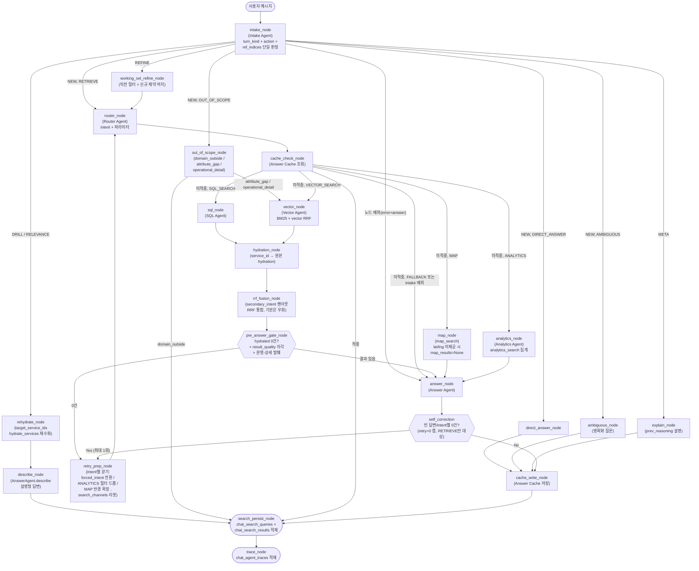

# AI 에이전트 설계

> 이 페이지는 사용자 질문이 어떤 과정을 거쳐 응답을 생성하는지, on-seoul-agent의 에이전트/도구/그래프 구조를 중심으로 설명한다.

---

## 1. 개요

`on-seoul-agent`는 사용자의 자연어 질문을 받아, 의도를 분류하고 적절한 검색 도구를 호출한 뒤, 자연어 답변과 시설 카드를 생성하는 **멀티 에이전트** 서비스이다. LangGraph `StateGraph` 를 기반으로 노드와 조건부 엣지로 조립된다.

| 구성 요소 | 위치 | 역할 |
|---|---|---|
| **에이전트** (Agent) | `agents/` | 수신 분류(턴 성격 / 행동 / 참조 판정), 검색 방향 결정, 파라미터 추출, 답변 생성 |
| **도구** (Tool) | `tools/` | DB 조회 추상화 (SQL / 벡터 / BM25 / 질문 / 지도 / 집계 / hydration / 운영-상세 단건) |
| **그래프** | `agents/graph.py` | LangGraph `StateGraph` 노드, 엣지 조립 및 실행 |

---

## 2. 전체 흐름

각 노드는 공유 상태인 **`AgentState`** 를 입력받아 바뀐 부분만 담은 dict를 반환한다. 상태를 합치는 일은 LangGraph가 맡으므로 노드 안에서 상태를 직접 고치지 않는다. 그래프 전체에는 진행 단계(super-step)를 50으로 제한(`recursion_limit=50`)하고 재시도는 1회로 묶어(`retry_count==0`) 무한 반복을 막는다. 가장 긴 경로(RETRIEVE + secondary 팬아웃 + 재시도 1회)가 약 23 super-step이고, 여유를 더해 50으로 잡았다.

> **참고사항**
> - **수신 단일화 (intake_node)**: 예전에는 직전 답변 지시 여부를 규칙으로 판정하는 `reference_resolution_node`와 행동을 LLM으로 정하는 `triage_node`가 따로 있었다. 지금은 둘을 **단일 LLM 노드 `intake_node`** 로 합쳤다. 한 번의 구조화 출력 호출로 **턴 성격(`turn_kind`)과 행동(`action`)을 동시에** 판정하고, 직전 결과를 가리키는 지시 참조도 함께 해소한다.
> - **인덱스 계약으로 ID 환각 차단**: 참조 해소에서 LLM은 `service_id`를 *생성*하지 않는다. 직전 결과 목록(`prev_entities`)을 1번부터 열거해 보여 주고, LLM은 **그중 몇 번을 가리키는지 인덱스만** 고른다(`ref_indices`). 런타임의 순수 함수(`agents/_intake_indexing.py`)가 `1 ≤ idx ≤ N` 범위를 검증한 뒤 배열에서 실제 `service_id`를 읽으므로, 존재하지 않는 ID가 끼어들 여지가 구조적으로 없다.
> - **route_intake — 단일 조건부 엣지**: `intake_node` 직후 `route_intake`가 모든 분기를 결정한다. 먼저 `turn_kind`로 1차 분기하고(`REFINE → working_set_refine_node`, `DRILL/RELEVANCE → rehydrate_node`, `META → explain_node`), `NEW`인 경우에만 `action`으로 2차 분기한다(`RETRIEVE → router_node`, 나머지는 각 action 노드). 노드 실행 중 예외가 난 경우(`error`와 `answer`가 모두 채워짐)는 곧장 `answer_node`로 보낸다.
> - **워킹셋 REFINE**: `turn_kind=REFINE`("그중 무료만", "좀 더 가까운 곳")이면 `working_set_refine_node`가 직전 턴의 검색 레시피(`prev_working_set.applied_filters`)에 **이번 발화의 신규 제약만** 머지해 다시 검색한다. 직전 의도를 그대로 이어가도록 `forced_intent`로 고정한 뒤 `router_node`로 재진입한다.
> - **Intake / Router 분리**: `intake_node`가 `action`(무엇을 할지)을 정하고, `RETRIEVE`일 때만 `router_node`가 `intent`(어떤 검색인지)와 파라미터를 정한다. RETRIEVE가 아닌 나머지 action은 router를 건너뛰고 곧바로 답변한다. `OUT_OF_SCOPE`의 `attribute_gap`/`operational_detail`만 예외적으로 `vector_node`로 합류해 시설 식별 검색을 수행한다.
> - **종단 체인 일관성**: 캐시 적중, 참조 해소, RETRIEVE가 아닌 action 경로 모두 `search_persist_node`를 거친다. `search_channels`가 비어 있으면 곧장 건너뛰므로, 추가 비용 없이 "cache_write → search_persist → trace"라는 종단 체인 형태를 항상 똑같이 유지한다.
> - **응답 캐시**: 흐름도의 `cache_check_node`/`cache_write_node`는 같은 질문이 반복될 때의 지연과 LLM 비용을 줄인다. 캐시 대상, 키, TTL, 무효화 정책은 아래 7장에서 다룬다.

---

## 3. 에이전트 (Agents)

하나의 LLM에게 분류, 조회, 답변을 한꺼번에 맡기면 관리도 테스트도 유지보수도, 무슨 일이 일어났는지 들여다보기도 모두 어려워진다. 그래서 on-seoul-agent는 역할이 다른 여러 에이전트로 나눠 맡긴다. **턴 성격과 행동을 함께 정하는** Intake, **어떻게 검색할지 정하는** Router, **데이터를 가져오는** 검색 전문가(SQL, Vector, Analytics, Map), 그리고 **답변을 쓰는** Answer다. 각 에이전트는 생성자 주입으로 따로따로 갈아 끼우고 테스트할 수 있으며, 공유 상태 `AgentState`만 주고받는다.

이 구성을 관통하는 한 가지 원칙이 있다. **LLM은 SQL을 직접 쓰거나 DB를 직접 만지지 않는다.** SQL 인젝션과 LLM 환각 위험을 막기 위해, LLM은 자연어에서 필터와 파라미터만 정해진 형식으로 뽑아내고 실제 조회는 파라미터를 바인딩한 도구가 맡는다.

### 3-1. Intake Agent — 턴 성격과 행동을 함께 정한다 (turn_kind + action)

`IntakeAgent`(`agents/intake_agent.py`)는 사용자 메시지를 받아 **이 턴이 무엇인지를 한 번에 끝내는 시작점**이다. 예전의 규칙 기반 참조 해소와 LLM 분류를 단일 노드로 합친 수신 단계로, 한 번의 구조화 출력(`with_structured_output(IntakeOutput)`) 호출로 다음을 동시에 산출한다.

- **`turn_kind`** — 턴 성격. `NEW`(신규 질문) / `REFINE`(직전 결과에 제약 추가) / `DRILL`(개별 상세) / `RELEVANCE`(집합 적합성) / `META`(판단 근거 설명). 불확실하면 `NEW`로 둔다.
- **`action`** — `turn_kind=NEW`일 때만 의미를 갖는 행동 유형. `RETRIEVE` / `DIRECT_ANSWER` / `AMBIGUOUS` / `OUT_OF_SCOPE`. (예전의 `EXPLAIN`은 `turn_kind=META`로 승격되어 여기서 빠졌다.)
- **`ref_indices`** — 지시 참조일 때 직전 결과 목록에서 고른 1-based 인덱스. LLM은 인덱스만 고르고 `service_id`는 만들지 않는다(ID 환각 차단).
- **`oos_type`** — `OUT_OF_SCOPE`일 때의 서브타입. `domain_outside` / `attribute_gap` / `operational_detail`.
- **`user_rationale`** — 사용자에게 보여 줄 판단 근거 한 문장.

#### route_intake 라우팅 + decision 이벤트

`intake_node` 직후 단일 조건부 엣지 `route_intake`가 모든 분기를 정한다. 먼저 `turn_kind`로 1차 분기하고, `NEW`인 경우에만 `action`으로 2차 분기한다.

| 분기 | 노드 | 동작 |
|---|---|---|
| `turn_kind=REFINE` | `working_set_refine_node` | 직전 검색 레시피에 신규 제약을 머지해 재검색(아래 3-2 참조) |
| `turn_kind=DRILL` / `RELEVANCE` | `rehydrate_node → describe_node` | 참조한 시설을 최신 원본으로 재조회 후 설명형 답변. 검색 스킵 |
| `turn_kind=META` | `explain_node` | 직전 턴의 판단 근거(`prev_reasoning`)를 설명. 근거가 없으면 `DIRECT_ANSWER`로 폴백 |
| `NEW` + `RETRIEVE` | `router_node` | 검색 계획 단계로 진행 |
| `NEW` + `DIRECT_ANSWER` | `direct_answer_node` | DB 없이 바로 답변. `intent=FALLBACK`으로 대화형 분기. 일상 대화, 기존 FALLBACK 안내문을 대체한다 |
| `NEW` + `AMBIGUOUS` | `ambiguous_node` | LLM이 대화 맥락(history)을 반영해 무엇을 찾는지 되묻는 명확화 질문 1개를 생성한다 (`AnswerAgent.clarify`). 추측 답변 금지 |
| `NEW` + `OUT_OF_SCOPE` | `out_of_scope_node` | 범위 밖(`domain_outside`)이면 즉시 거절한다. 단, 시설은 맞는데 속성만 모자란 경우(`attribute_gap`)나 운영-상세(`operational_detail`)는 시설 식별을 위해 `vector_node`로 합류한다 |

**폴백 두 계층**: (A) 분류가 모호하면(파싱 실패, 미지/누락 값) `turn_kind`를 `NEW`, `action`을 `RETRIEVE`로 강등하고 `node_path`에 breadcrumb를 남긴다 — 새 폴백 경로를 만들지 않고 기존 0건 게이트와 self-correction이 정상적으로 강등을 처리하게 한다. 참조인데 인덱스 바인딩이 실패한 경우(빈 `prev_entities`, 범위 밖)도 조작 ID를 만들지 않고 `NEW`+`RETRIEVE` 검색 경로로 정직하게 수렴한다. (B) 노드/LLM 자체가 예외를 던지면 `DIRECT_ANSWER` + `error` + 안내 메시지로 폴백하고 self-correction을 건너뛴다.

**decision 이벤트**: `stream()`이 `decision` SSE 이벤트(`schemas/events.py`의 `DecisionEvent`)를 전체 실행에서 한 번 내보낸다. "왜 이렇게 판단했는지"를 사용자에게 투명하게 보여 주기 위한 것으로, action과 근거 한 문장(`user_rationale`)을 담는다. 검색을 도는 경로(`NEW`+`RETRIEVE`, `REFINE`)에서는 검색 경로(`routes`)를 함께 채워야 하므로 `router_node`가 끝난 뒤 발행하고, 검색을 건너뛰는 경로(DRILL/RELEVANCE/META, 비-RETRIEVE NEW)에서는 `intake_node`가 `routes=[]`로 곧장 발행한다(참조 경로는 선택된 시설 라벨을 근거 문장에 덧붙인다). 근거 문장은 내부 식별자가 새어 나가지 않도록 다듬으며(`sanitize_user_rationale`), LLM 분류를 건너뛴 경우(강제 재시도)에는 내보내지 않는다(`decision_emitted` 가드).

### 3-2. working_set_refine — 직전 레시피에 제약을 더한다 (REFINE)

`turn_kind=REFINE`("그중 무료만", "좀 더 가까운 곳")은 직전 검색을 *이어가는* 턴이다. `working_set_refine_node`는 직전 턴의 검색 레시피(`prev_working_set.applied_filters`)를 베이스로 삼고, 이번 발화에서 새로 등장한 제약만 `RouterAgent`로 정제해 머지한다(같은 키가 충돌하면 이번 발화가 이긴다). 신규 제약을 추출하지 않으면 "그중 무료만"의 `payment_type=무료`가 소실되어 직전 결과로만 돌아가므로, 신규 제약 추출은 REFINE의 핵심이다. 직전 의도를 그대로 이어가도록 `forced_intent`로 고정한 뒤 `router_node`로 재진입한다(이 노드도 SQL/DB는 손대지 않는다 — 필터 정제만 한다).

> **carryover 철학(스냅샷이 아님)**: 직전 결과를 통째로 캐싱해 재사용하지 않는다. 정체성(`service_id`)과 검색 레시피만 운반하고, 시설 사실(상태, 일정)은 항상 최신 원본에서 다시 읽는다. 직전 베이스가 비어 있으면(`no_base`) 사실상 신규 검색과 같으므로 그 사실을 trace에 breadcrumb로 남긴다.

### 3-3. Router Agent — 어떻게 검색할지 정한다 (intent)

action이 `RETRIEVE`일 때(그리고 REFINE 재진입 시)만 `RouterAgent`(`agents/router_agent.py`)가 이어받아 **어떤 검색으로, 어떤 조건으로** 찾을지 계획한다. 검색 방식(`intent`)을 고르고, 같은 LLM 호출에서 정제 질의(`refined_query`), 후처리 필터(post-filter)용 메타데이터(자치구, 상태, 카테고리, 결제유형), 벡터 세부 의도를 함께 뽑는다. RETRIEVE가 아닌 action은 Router까지 오지 않으므로 `intent`는 `FALLBACK`으로 남는다.

| IntentType | 분류 기준 | 예시 |
|---|---|---|
| `SQL_SEARCH` | 카테고리, 자치구, 접수 상태, 날짜 등 정형 조건 | "지금 접수 중인 수영장" |
| `VECTOR_SEARCH` | 키워드, 의미 기반 유사 시설 탐색 | "아이랑 체험할 수 있는 곳" |
| `MAP` | 지도, 위치, 반경 탐색 | "내 주변 500m 이내 체육관" |
| `ANALYTICS` | 개수, 분포, 종류 등 집계 질의 | "강남구에 체육시설이 몇 개야?" |

SQL-VECTOR 경계가 모호하면 `secondary_intent`로 두 경로를 병렬 팬아웃할 수 있다(`enable_secondary_intent` 플래그, 기본 off).

> **왜 기본은 꺼 두나**: 팬아웃을 켜면 한 질의에 `sql_node`와 `vector_node`가 동시에 돌고 그 결과를 `rrf_fusion_node`가 다시 합치므로, 검색과 DB 호출 과정이 사실상 2배가 된다. 우선은 이 비용을 항상 감수할 만큼 경계가 모호한 케이스가 흔치 않다고 예상하여, 결과를 일부 놓치더라도 지연과 부하를 줄이는 방향으로 설계했다.

> **참고사항**
> - 뽑아낸 필터(`area_name`, `service_status`, `payment_type` 등)가 도메인 허용 목록(화이트리스트)에 없는 값이면 `None`으로 맞춘다. 잘못된 값이 캐시 키를 더럽히거나 빈 검색을 만들지 않게 하기 위해서다.
> - 재시도 경로나 REFINE 경로에서 `forced_intent`가 들어오면 LLM 재분류를 건너뛰고 그 의도로 한 번만 검색한다(쓰고 나면 바로 비운다). 방향을 바꾸는 재시도(SQL→VECTOR 전환 등)가 intake가 아니라 Router로 다시 들어오는 것도, 결국 "검색 *계획*을 다시 세우는" 일이기 때문이다.

### 3-4. SQL Agent — 정형 조건 조회

"지금 마포구에 접수 중인 수영장"처럼 카테고리, 자치구, 상태, 키워드로 또렷이 걸러지는 질의를 담당한다. LLM은 메시지에서 필터 값만 뽑고, 실제 조회는 `sql_search` 도구가 파라미터화 SQL로 수행한다. 결과는 개별 시설 목록이다.

### 3-5. Vector Agent — 의미 기반 검색 (4채널 하이브리드)

"아이랑 체험할 수 있는 곳"처럼 정형 필터로는 잡히지 않는 **의미 중심 질의**를 담당한다.

의미 검색을 잘하려면 한 가지 방식만으로는 부족하다. 그래서 서로 다른 관점의 **4개 채널**을 함께 돌리고 결과를 합친다.

- **Track A (identity)** — 시설 신원 임베딩. 자치구, 상태 등은 검색 뒤 후처리 필터(post-filter)로 거른다.
- **Track B (summary)** — 자연어 요약 임베딩.
- **Track C (question)** — "이 시설로 답할 만한 예상 질문" 임베딩.
- **BM25** — 정확 키워드 매칭(전문 검색). 한국어는 `tools/tokenizer.py`가 Kiwi로 의미 형태소만 추려 검색어로 쓴다. 토크나이저가 두 계층(쿼리 전처리 Kiwi + 색인 매칭 `korean_lindera`)으로 나뉜 배경은 [하이브리드 검색 전략](./hybrid-search-strategy)을 참조한다.

채널마다 점수 척도가 달라 단순 합산이 어렵다. 그래서 각 채널의 *순위*만 모아 통합하는 **RRF(Reciprocal Rank Fusion)**를 쓴다(`core/rrf.py`). 4채널은 채널별 독립 세션을 열어 병렬 실행하며, 세마포어로 커넥션 풀 고갈을 막는다. RRF를 택한 이유와 채널 가중치 설계는 [RRF 결합 전략](./RRF-Strategy)에서 자세히 다룬다.

> **원본 재조회 분리**: 검색은 임베딩에 붙은 메타데이터를 쓰는데, 이 값(상태, 접수일 등)은 시간이 지나면 실제와 어긋난다(stale). 그래서 검색이 끝나면 별도 `hydration_node`가 `service_id`로 원본 테이블을 다시 읽어 `hydrated_services`에 채운다. Answer Agent는 검색 경로와 무관하게 이 단일 슬롯만 본다 — SQL 경로는 이미 원본 행이라 그대로 통과한다.

### 3-6. Analytics Agent — 집계, 분포 질의

"강남구에 체육시설이 몇 개야?"처럼 개수, 분포, 종류를 묻는 집계 질의를 담당한다. 개별 목록을 주는 SQL_SEARCH와 구별되며, 집계 값만 필요하므로 원본 재조회(hydration)는 거치지 않는다. 여기서도 LLM은 집계 파라미터만 뽑고 `analytics_search`가 GROUP BY/DISTINCT를 실행한다.

### 3-7. Answer Agent — 답변 생성

모든 검색 경로의 결과는 마지막에 `AnswerAgent` 하나로 모여 자연어 답변과 시설 카드가 된다. 답변, 카드 포맷을 한곳에서 관리해 일관성을 유지하기 위해서다.

핵심 규칙은 두 가지다. 시설에 `service_url`이 없으면 서울 예약 포털(`https://yeyak.seoul.go.kr`)로 대신 연결하고, 입력에 이미 `error`와 `answer`가 모두 채워져 있으면(intake 예외 등) LLM을 다시 부르지 않고 그대로 돌려준다. 성능을 위해 내용이 고정된 프롬프트(MAP/ANALYTICS/FALLBACK)는 시작할 때 한 번만 만들어 두고, 매번 내용이 달라지는 카드형(SQL/VECTOR) 프롬프트만 호출하는 순간에 맞춰 조립한다.

검색 경로 외에도 Answer Agent는 몇 가지 전용 산출을 더 소비한다. **결과 품질 자각**(`result_quality`)이 채워져 있으면 답변의 톤과 제안을 조정하고(아래 6장), **운영-상세 발췌**(`detail_excerpt`)가 채워져 있으면 폭염, 휴무, 주차, 우천 같은 운영 질문에 그 발췌를 근거로 실답변을 만든다(아래 3-8). 직전 답변에 통합회원 안내가 이미 나갔으면(`reservation_guide_shown`) 같은 안내를 반복하지 않는다.

### 3-8. 운영-상세 발췌 — detail_excerpt

폭염 시 운영 여부, 휴무일, 주차, 우천 시 진행처럼 시설 카드의 정형 필드로는 답할 수 없지만 원본 상세 설명(`detail_content`) 안에는 적혀 있는 질문이 있다. `intake_node`가 이를 `OUT_OF_SCOPE`의 `operational_detail` 서브타입으로 분류하면, 시설 식별 검색(VECTOR) 뒤 `pre_answer_gate_node`가 지목된 단건(focal) 시설의 상세 본문을 가져와 발췌까지 끝내 `detail_excerpt` 슬롯에 적재한다.

발췌, 정제는 모두 상류가 담당하고 Answer Agent는 준비된 문자열만 소비한다. 단건 원본 조회는 `tools/fetch_detail_content.py`가, 노출 전 정제와 키워드 발췌는 `agents/detail_excerpt.py`(DB/LLM 무관 순수 함수)가 맡는다. 정제 파이프라인은 본문에서 질의 키워드(동의어 그룹 포함, 예: "폭염"이 본문의 "무더위"도 잡도록) 주변을 발췌하고, 휴대폰 번호 같은 PII를 마스킹하며, 프롬프트 경계 마커를 중화한다. 질의 키워드가 본문에 없거나 발췌가 너무 짧으면 `None`을 반환해 거짓 발췌와 환각을 막는다 — 이 경우 Answer Agent는 운영-상세 실답변 대신 `attribute_gap`과 동일한 정직한 리다이렉트로 폴백한다. raw 블롭은 일반 hydration과 분리되어 절대 카드나 답변에 실리지 않는다.

---

## 4. 도구 (Tools)

앞에서 본 "LLM은 DB를 직접 만지지 않는다"는 원칙을 실제로 떠받치는 게 도구 계층이다. 에이전트는 자연어에서 파라미터만 뽑고, 조회는 `tools/`의 독립 함수가 맡는다. 필터 값은 모두 바인딩 파라미터로 넘어가고, 컬럼이나 정렬 같은 식별자는 코드에 박아 둔 허용 목록에서만 골라 쓰므로 SQL 인젝션 여지가 없다.

도구는 질의 성격에 따라 나뉜다.

- **정형 필터** (`sql_search`) — 카테고리, 자치구, 상태, 키워드로 또렷이 걸러지는 조회. 개별 시설 목록을 반환한다.
- **의미 하이브리드** (`vector_search`, `bm25_search`, `question_search`) — 임베딩 유사도와 키워드(BM25)를 RRF로 결합한다. 벡터 검색은 pgvector HNSW 인덱스가 WHERE 조건과 함께 동작하지 못하는 특성 때문에, 상위 N을 먼저 뽑고 후처리로 거르는 **post-filter** 전략을 쓴다.
- **위치 반경** (`map_search`) — `earthdistance`로 사용자 좌표를 기준 삼아 반경 안의 시설을 가까운 순서대로 GeoJSON으로 돌려준다. 좌표가 들어오지 않으면 FALLBACK으로 넘어간다.
- **집계** (`analytics_search`) — GROUP BY COUNT / DISTINCT. 컬럼명은 화이트리스트 dict 값만 삽입한다.
- **원본 hydration** (`hydrate_services`) — 검색이 끝난 뒤 `service_id`로 원본 테이블 최신 행을 다시 읽는 보조 도구. 임베딩 메타데이터의 stale 값이 답변에 새지 않게 한다.
- **운영-상세 단건** (`fetch_detail_content`) — 운영-상세(`operational_detail`) 경로에서 지목된 단건 시설의 `detail_content` 원문(최대 수백 KB)을 SELECT한다. 일반 카드 컬럼 목록(`_result_columns`)과 분리해 raw 블롭이 다른 경로로 새지 않게 하며, 노출 전 정제와 발췌는 `agents/detail_excerpt.py`가 담당한다(위 3-8).

각 도구의 파라미터, 반환 스키마, DB 세션 라우팅 같은 세부는 저장소의 `tools/` 모듈에 코드와 함께 정리돼 있다. 토큰화 동작은 [하이브리드 검색 전략](./hybrid-search-strategy)을 참조한다.

---

## 5. 공유 상태 — AgentState

에이전트 간 데이터는 `AgentState` (TypedDict)로 흐른다. LangGraph가 부분 업데이트 dict를 자동으로 병합한다.

핵심 필드만 추린다. 라우팅 세부, 관측, 재시도 제어용 보조 슬롯은 "그 외"로 묶었으며, 전체 정의는 `schemas/state.py`가 단일 출처다.

상태는 보편 입력과 carryover 입력 같은 평면 슬롯과, 단계별 working state를 담는 중첩 서브 채널(`triage`, `plan`, `filters`, `sql`, `vector`, `map`, `analytics`, `hydration`, `output`, `emit`)로 나뉜다. 여러 노드가 서로 다른 키를 다른 단계에 기록하는 채널(`plan`/`filters`/`emit`)에는 얕은 머지 reducer가, `node_path`와 `search_channels`에는 누적 reducer가 붙어 있다.

| 필드 (채널) | 작성 주체 | 설명 |
|---|---|---|
| `room_id`, `message_id`, `message`, `title_needed`, `user_lat`/`user_lng` | 호출자 | 입력 — 대화방, 메시지 ID, 사용자 질문, 제목 생성 여부, MAP용 좌표 |
| `history`, `prev_entities`, `prev_reasoning`, `prev_working_set` | 호출자 | 직전 턴 맥락 — 대화 이력, 직전 결과 시설(지시 참조용), 직전 판단 근거(META 설명용), 직전 검색 레시피(REFINE 재검색용 중첩 채널) |
| `triage.turn_kind`, `triage.action`, `triage.out_of_scope_type`, `triage.user_rationale` | intake_node | 수신 분류 — 턴 성격(REFINE/DRILL/RELEVANCE/META/NEW), 행동(NEW일 때 의미), OOS 서브타입, 근거 한 문장 |
| `target_service_ids` | intake_node | 지시 참조로 바인딩된 `service_id` 리스트(인덱스 → ID 매핑 결과) |
| `plan.intent`, `plan.refined_query`, `plan.vector_sub_intent`, `plan.secondary_intent` | router_node | RETRIEVE 경로의 검색 의도(SQL/VECTOR/MAP/ANALYTICS, 아니면 FALLBACK) + 정제 질의 + 벡터 세부 의도 |
| `filters.{max_class_name, area_name, service_status, payment_type}` | router_node / working_set_refine_node / retry_prep_node | post-filter 메타데이터 (RETRIEVE/REFINE 경로, 재시도 시 부분 드롭) |
| `sql.results` / `vector.results` / `map.results` / `analytics.results` | 검색 노드 | intent별 검색 결과 |
| `hydration.hydrated_services` | hydration_node / rehydrate_node | `service_id`로 재조회한 최신 원본. AnswerAgent가 검색 경로와 무관하게 보는 단일 슬롯 |
| `result_quality` | pre_answer_gate_node | RETRIEVE 결과의 쏠림/빈약 휴리스틱 자각(없으면 None). answer가 톤, 제안 조정에 소비 |
| `detail_excerpt` | pre_answer_gate_node | 운영-상세 turn에서 focal 단건 상세 본문 발췌(없으면 None = 폴백 신호). answer가 소비 |
| `output.{answer, title, service_cards}` | answer_node / action 노드 | 최종 자연어 답변 / 대화 제목 / 카드 UI용 상위 N건 |
| `trace`, `error`, `retry_count` | trace_node / 각 노드 / retry_prep_node | 관측 메타데이터, 오류 메시지, 재시도 횟수(최대 1) |
| **그 외** | — | `forced_intent`, `retry_radius_m`, `retry_relaxed`, `relaxed_filters`, `reservation_guide_shown`, `rrf_merged_ids`, `node_path`, `search_channels`, `cache_hit`, `answer_lock_key`, `emit.*`(SSE emit-once 가드) 등 라우팅 세부, 관측, 재시도 제어용 보조 슬롯 |

---

## 6. 그래프 실행

`AgentGraph.run(state)` 한 번 호출로 intake → 분기 → (검색 또는 직접 답변) → answer → self-correction → 종단 체인 적재가 끝난다. `AgentGraph.stream(state)`은 같은 실행을 `(event_type, data)` 튜플 스트림(`progress` / `decision` / `sources_update` / `result`)으로 흘려보내 SSE 릴레이에 쓴다. DB 세션은 인자로 받지 않고 각 노드가 실행 시점에 풀에서 잡고 즉시 반납한다(acquire-use-release). 각 에이전트는 생성자 주입으로 교체할 수 있어 테스트에서 Mock으로 대체한다.

설계의 핵심은 세 가지다.

**상태와 제어의 분리** — 노드는 `AgentState`를 읽어 부분 업데이트 dict를 반환할 뿐, 다음 노드를 직접 지목하지 않는다. 전이는 그래프 빌드 시점에 무조건 엣지와 조건부 엣지로 선언되고, 조건부 엣지의 분기 함수는 state만 읽는 순수 함수다. "어디로 갈지"를 결정하는 신호(`turn_kind`, `action`, `intent`, `cache_hit`, `hydrated_services` 등)는 모두 앞선 노드가 state에 써 둔 값이다. 분기를 코드가 아니라 데이터로 다루므로 경로를 추적, 테스트하기 쉽다. 조건부 엣지는 수신 분기(`route_intake`), 캐시 적중(`post_cache_check`), 범위 밖 처리(`_out_of_scope_route`), 0건 게이트(`route_pre_answer_gate`), 자기 교정(`self_correction_edge`) 다섯 곳에서 state 신호만 읽어 다음 노드를 정한다. 그중 `route_intake`는 `turn_kind` 1차 분기와 `NEW`의 `action` 2차 분기를 한 함수가 모두 처리하는 단일 수신 라우터다.

**자기 교정(Self-Correction)** — 검색이 0건이거나 답변이 비면 한 번만 다시 시도한다. 단순히 조건을 푸는 게 아니라 방향을 바꾼다 — 정형 검색(SQL)이 비면 의미 검색(VECTOR)으로 강제 전환하고, 지도 검색이 비면 반경을 넓히는 식이다. 빈 결과로 답변 LLM을 낭비하지 않도록, 검색 직후 `pre_answer_gate_node`가 0건을 감지하면 답변 생성 전에 곧장 재시도로 보낸다(0건 게이트, `route_pre_answer_gate`). 무한 루프는 재시도 1회 캡(`retry_count`)과 `recursion_limit=50`으로 막는다. **왜 하필 1회인가**: 0회면 SQL→VECTOR 전환, 반경 확장 같은 방향 전환의 복구 기회를 통째로 잃고, 2회 이상이면 검색, LLM 호출이 누적되어 지연과 비용이 커지는 데 비해 추가 복구율은 미미하다. 빈 결과의 대부분이 한 번의 방향 전환으로 해소된다고 보고, 복구 가능성과 응답 지연 사이에서 1회를 택했다. 재시도는 intake를 거치지 않고 `router_node`로 재진입한다(action은 이미 RETRIEVE로 확정). intent별 재시도 동작은 `retry_prep_node`가 분기한다 — SQL은 VECTOR로 강제 전환, ANALYTICS는 가장 제약이 큰 필터 1개를 드롭, MAP은 반경을 넓히고, `attribute_gap`/`operational_detail` 검색은 0건을 유발한 필터를 완화한다. self-correction은 RETRIEVE 경로 전용이라 비-RETRIEVE action(DIRECT_ANSWER/AMBIGUOUS/OUT_OF_SCOPE의 domain_outside)은 평가에서 제외된다.

**결과 품질 자각(전진 패스)** — 재시도가 0건만 다룬다면, "결과는 있지만 빈약하거나 한쪽으로 쏠려 있는" 경우는 자기 교정 대상이 아니다. 이를 위해 `pre_answer_gate_node`가 0건 판정과 함께 RETRIEVE 결과의 성격을 경량 휴리스틱으로 점검한다 — 결과가 1~2건이면 빈약(thin), 결과가 충분한데도(3건 이상) 자치구 한 곳에 임계 이상 몰려 있으면 쏠림(skew)으로 보고 `result_quality` 슬롯에 적재한다. 이는 **재검색을 트리거하지 않는다**(라우팅 불변, 전진 1회). Answer Agent가 이 신호를 읽어 답변의 톤과 후속 제안만 조정한다(예: "결과가 많지 않습니다", "대부분 OO구에 있습니다"). 점검이 실패해도 `result_quality=None`으로 격리되어 답변을 막지 않는다(best-effort). 같은 노드가 운영-상세 turn이면 `detail_excerpt`도 함께 준비한다(위 3-8).

---

## 7. 응답 캐시 (Answer Cache)

같은 질문을 여러 사용자가 던지면 매번 검색하고 LLM을 부르는 건 낭비다. 그래서 흐름도의 `cache_check_node`가 답변을 만들기 전에 캐시를 먼저 들여다보고, `cache_write_node`가 새로 만든 답변을 Redis에 저장한다. 캐시 동작 코드는 `core/cache.py`가 단일 출처다.

캐시는 빠르지만 위험을 함께 안는다. 시설 상태(접수중/마감)는 수시로 바뀌는데, 캐시에 남은 답변은 그 변화를 모른다. 그래서 이 섹션의 정책 대부분은 **속도와 신선함(stale 회피) 사이의 균형**을 잡기 위한 것이다.

### 7-1. 무엇을 캐시하나

검색 결과가 비교적 안정적인 `SQL_SEARCH`/`VECTOR_SEARCH` 두 경로만 캐시한다(`answer_cache_eligible_intents`). MAP은 사용자 좌표마다 결과가 달라 적중률이 낮고, ANALYTICS는 집계 값이라 데이터가 바뀌면 곧장 어긋나며, FALLBACK은 검색 자체가 없어 모두 제외한다. 오류가 난 응답(`error` 있음)도 저장하지 않는다.

### 7-2. 캐시 키 — 검색 필터까지 담는다

키는 정제 질의(`refined_query`)에 더해 **post-filter 4종(자치구, 상태, 카테고리, 결제유형)과 검색 경로(`routes`)** 까지 합쳐 SHA256으로 해싱한다(`answer_cache:{해시 32자}`). 질의 문자열만으로 키를 만들면, "마포구 수영장"과 "강남구 수영장"이 정제 후 같은 질의로 보일 때 엉뚱한 캐시가 적중할 수 있다. 필터를 키에 넣어 이런 오염을 막는다.

### 7-3. TTL — 수집 주기보다 짧게

캐시는 두 단계 TTL로 만료시킨다.

- **정상 결과**: 15분(`answer_cache_ttl`). 데이터 수집이 하루 한 번이므로, 그보다 충분히 짧게 잡아 stale 노출 시간을 제한한다.
- **빈 결과**: 5분(`answer_cache_empty_ttl`). "결과 없음"은 더 빨리 다시 시도해 볼 여지가 있어 짧게 둔다.

### 7-4. 무효화 — 수집 직후 비우기

TTL만으로는 수집 직후의 신선함을 보장하지 못한다. 그래서 수집 스케줄러가 데이터를 갱신한 직후 `/admin/cache/flush`를 호출해 `answer_cache:*` 키를 한꺼번에 비운다. 다음 질문부터는 갱신된 데이터로 답변이 다시 만들어진다.

### 7-5. 동시 요청 처리 (singleflight)

캐시가 비어 있을 때 같은 질문이 동시에 몰리면, 그대로 두면 모든 요청이 똑같은 LLM 호출을 중복으로 일으킨다. 이를 막기 위해 첫 요청만 락(`SET NX EX`)을 잡고 LLM을 실행하고, 나머지 요청은 잠깐(최대 6회 × 0.5초 = 3초) 결과를 기다렸다가 채워진 캐시를 읽는다(`answer_cache_singleflight_enabled`).

다만 Redis 장애나 대기 시간 초과 시에는 **락을 포기하고 각 요청이 직접 LLM을 호출한다**. 중복 호출은 허용하더라도, 캐시 계층이 사용자 응답 자체를 막는 단일 장애점이 되지 않게 하기 위해서다.

### 7-6. 정제 질의 캐시 (refine_cache)

같은 질의의 **검색 계획(정제 질의, 필터)은 데이터가 바뀌어도 변하지 않는다.** 그래서 이 부분만 따로 `refine_cache:*` 네임스페이스에 6시간(`refine_cache_ttl`) 동안 캐시한다. 데이터에 의존하지 않으므로 수집 무효화(`/admin/cache/flush`) 대상이 아니며, 네임스페이스가 달라 응답 캐시 flush에도 걸리지 않는다.

---

## 8. 오류 처리

운영 시점에 사용자 응답 품질과 디버깅에 직결되는 정책이므로 별도 섹션으로 정리한다.

### 8-1. `error` 필드의 의미

- 노드 실행 중 발생한 예외 메시지를 문자열로 저장한다.
- `None` 이면 정상 완료, 값이 있으면 그래프 어딘가에서 예외가 발생했음을 의미한다.
- `trace.error` 에도 동일한 값이 기록되어 `chat_agent_traces` 테이블로 영구 보존된다.
- SSE `workflow_error` 이벤트로 전달될 때는 내부 메시지가 그대로 노출되지 않도록 제거한다. ("서비스 처리 중 오류가 발생했습니다.").

### 8-2. 대체(Fallback) 메시지 정책

| 상황 | 처리 |
|---|---|
| intake_node 예외 발생 | `answer` 에 안내 메시지 주입, `error` 에 원인 기록, `action=DIRECT_ANSWER` + `turn_kind=NEW` 설정, `node_path` 에 `"intake_error"` 추가, `route_intake` 가 곧장 `answer_node` 로 보냄, self-correction 건너뜀(RETRIEVE가 아닌 경로) |
| sql/vector/map/analytics/hydration/answer 노드 예외 | `error` 필드 기록, `node_path` 에 `"*_error"` 추가, 가능하면 빈 결과로 다음 노드 진행 |
| rehydrate_node 예외 | `hydrated_services=[]` 로 폴백, `node_path` 에 `"rehydrate_error"` 추가. describe_node가 정직하게 0건을 안내 |
| `MAP` intent 인데 `lat`/`lng` 미제공 | `map_node` 내부에서 검색을 생략하고 `map_results=None`을 반환한 뒤 `answer_node` 로 진행. `node_path` 에는 정상 경로와 똑같이 `"map_node"`가 추가된다. |
| Answer Agent 결과의 `service_url` 누락 | `https://yeyak.seoul.go.kr` 로 대신 연결 |

예외 발생 시 사용자에게 노출되는 메시지:

> 죄송합니다, 일시적인 오류가 발생했습니다. 잠시 후 다시 시도해 주세요.

### 8-3. Trace 적재 정책 (실패해도 응답은 지킨다)

`chat_agent_traces` 적재는 `trace_node` 에서 실행되며, 다음 원칙을 따른다.

- **저장이 실패해도 그래프 결과는 흔들리지 않는다.** trace 저장이 실패했다고 사용자 응답이 사라지는 일은 없도록 보장한다.
- 저장이 실패하면 `logger.warning` 으로만 남기고 세션을 롤백한다.
- 본문 노드에서 예외가 나더라도 `trace_node` 가 마지막 노드로 항상 도달하므로, 실패한 실행도 나중에 분석할 수 있다.

### 8-4. Search Persist 적재 정책 (실패해도 응답은 지킨다)

`chat_search_queries` + `chat_search_results` 적재는 `search_persist_node` 에서 실행되며, trace 와 똑같이 "실패해도 사용자 응답은 지킨다"는 원칙을 따른다.

- **두 테이블은 하나의 트랜잭션** 으로 묶여 함께 커밋 / 롤백된다. 한쪽만 적재되어 일관성이 깨지는 일을 막기 위해서다.
- 결과가 0건이어도 `chat_search_queries` 의 query 행은 남긴다 ("검색했지만 결과가 없었다"는 사실도 재현율(recall)이나 불용어(stopword)를 진단할 단서다).
- INSERT가 실패하면 `logger.warning` + 롤백 + `node_path += "search_persist_error"` 만 남기고 `trace_node` 로 진행한다.
- `search_channels` 가 비어 있으면 적재 과정을 통째로 건너뛴다. 캐시 적중 경로와 FALLBACK intent 가 여기에 해당한다.
