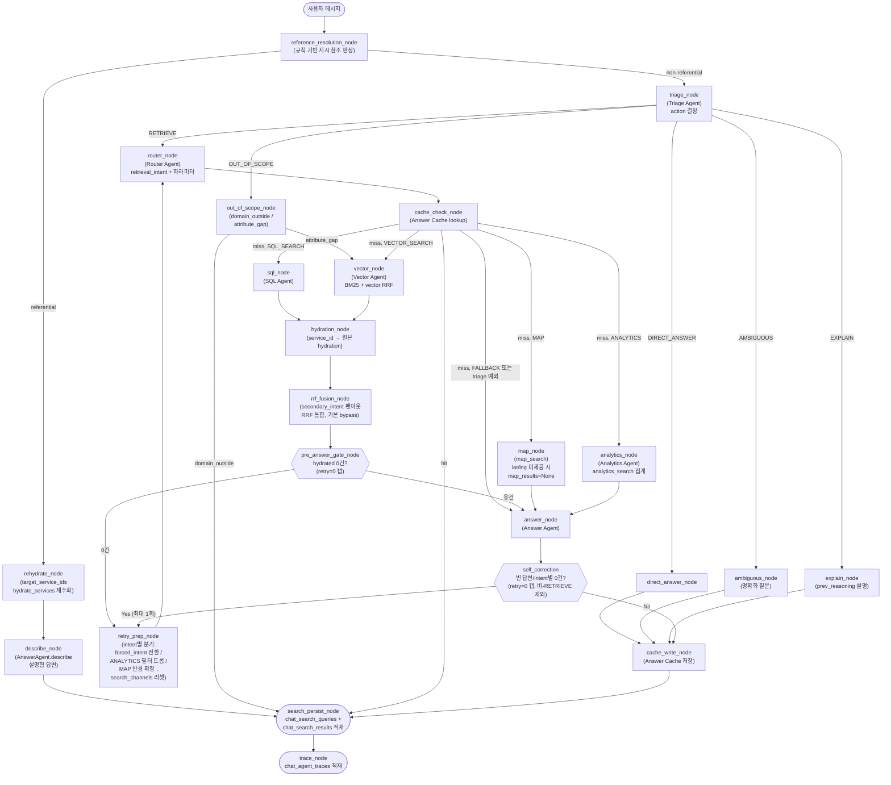

# AI 에이전트 설계

> 이 페이지는 사용자 질문이 어떤 과정을 거쳐 응답을 생성하는지, on-seoul-agent의 에이전트/도구/그래프 구조를 중심으로 설명한다.

---

## 1. 개요

`on-seoul-agent`는 사용자의 자연어 질문을 받아, 의도를 분류하고 적절한 검색 도구를 호출한 뒤, 자연어 답변과 시설 카드를 생성하는 **멀티 에이전트** 서비스이다. LangGraph `StateGraph` 를 기반으로 노드와 조건부 엣지로 조립된다.

| 구성 요소 | 위치 | 역할 |
|---|---|---|
| **에이전트** (Agent) | `agents/` | 분류(행동 / 검색 방향 결정), 파라미터 추출, 답변 생성 |
| **도구** (Tool) | `tools/` | DB 조회 추상화 (SQL / 벡터 / BM25 / 질문 / 지도 / 집계 / hydration) |
| **그래프** | `agents/graph.py` | LangGraph `StateGraph` 노드, 엣지 조립 및 실행 |

---

## 2. 전체 흐름

각 노드는 공유 상태인 **`AgentState`** 를 입력받아 부분 업데이트 dict를 반환한다. LangGraph가 상태 병합을 담당하므로 노드 내부에서 직접 변이하지 않는다. 그래프 전체에는 super-step을 28로 제한(`recursion_limit=28`)하고 재시도는 1회 캡(`retry_count==0`)을 둬 무한 사이클을 방지한다. RETRIEVE 경로에 router 단계가 더해져 재시도 1회 포함 최악 경로가 늘어났고, 여유를 더해 28로 설정한다.

> **참고사항**
> - **참조 해소 경로**: `reference_resolution_node`가 `prev_entities`를 근거로 현재 메시지가 직전 턴 시설을 가리키는 지시 참조인지 규칙 기반(LLM 미사용)으로 판정한다. referential이면 `rehydrate_node → describe_node`로 검색을 우회하고, 비참조이면 `triage_node`로 진행한다(기존 흐름, 하위호환).
> - **Triage / Router 분리**: `triage_node`가 `action`(무엇을 할지)을 정하고, `RETRIEVE`일 때만 `router_node`가 `retrieval_intent`(어떤 검색인지)와 파라미터를 정한다. 비-RETRIEVE 4종은 router를 건너뛰고 곧바로 답변한다. `OUT_OF_SCOPE`의 `attribute_gap`만 예외적으로 `vector_node`로 합류해 시설 식별 검색을 수행한다.
> - **종단 체인 일관성**: cache hit, 참조 해소, 비-RETRIEVE action 경로 모두 `search_persist_node`를 경유한다. 빈 `search_channels`는 즉시 skip되어 오버헤드 없이 "cache_write → search_persist → trace" 종단 체인 형태를 항상 동일하게 유지한다.

---

## 3. 에이전트 (Agents)

하나의 LLM에게 분류, 조회, 답변을 한꺼번에 맡기면 관리 및 테스트, 유지보수성, 관측이 모두 어려워진다. 그래서 on-seoul-agent는 역할이 다른 멀티 에이전트를 오케스트레이션 하도록 한다. — **무엇을 할지 정하는** Triage, **어떻게 검색할지 정하는** Router, **데이터를 가져오는** 검색 전문가(SQL, Vector, Analytics, Map), 그리고 **답변을 쓰는** Answer. 각 에이전트는 생성자 주입으로 독립적으로 교체, 테스트할 수 있고, 공유 상태 `AgentState`만 주고받는다.

이 구성을 관통하는 한 가지 원칙이 있다. **LLM은 SQL을 직접 쓰거나 DB를 직접 만지지 않는다.** SQL Injection 및 LLM 환각 리스크를 방지하기 위해 LLM은 자연어에서 필터, 파라미터만 구조화 출력으로 추출한 후 실제 조회는 파라미터화된 도구가 수행한다.

### 3-1. Triage Agent — 무엇을 할지 정한다 (action)

`TriageAgent`(`agents/triage_agent.py`)는 사용자 메시지를 받아 **무엇을 할지(action)를 정하는 시작점**이다.
`action`은 여러 유형에 대해 유연하게 대응하여 자연스러운 사용 경험을 제공하기 위한 방향을 결정한다.

#### action 라우팅 + decision 이벤트

`triage_node` 직후 `route_by_action`이 action별로 분기한다. `RETRIEVE`만 Router로 가고, 나머지 4종은 검색 없이 답변을 만들어 종단 체인으로 진행한다.

| action | 노드 | 동작 |
|---|---|---|
| `RETRIEVE` | `router_node` | 검색 계획 단계로 진행 |
| `DIRECT_ANSWER` | `direct_answer_node` | DB 없이 바로 답변. `intent=FALLBACK`으로 대화형 분기. 일상 대화, 기존 FALLBACK 안내문을 대체한다 |
| `AMBIGUOUS` | `ambiguous_node` | LLM이 대화 맥락(history)을 반영해 무엇을 찾는지 되묻는 명확화 질문 1개를 생성한다 (`AnswerAgent.clarify`). 추측 답변 금지 |
| `OUT_OF_SCOPE` | `out_of_scope_node` | 범위 밖(`domain_outside`)이면 즉시 거절한다. 단, 시설은 맞는데 속성만 모자란 경우(`attribute_gap`)는 시설 식별을 위해 `vector_node`로 합류한다 |
| `EXPLAIN` | `explain_node` | 직전 턴의 판단 근거(`prev_reasoning`)를 설명한다. 근거가 없으면 `DIRECT_ANSWER`로 폴백한다 |

**decision 이벤트**: Triage가 LLM 분류를 수행하면 `stream()`이 `decision` SSE 이벤트(`schemas/events.py`의 `DecisionEvent`)를 한 번 발송한다. "왜 이렇게 판단했는지"를 사용자에게 투명하게 보여주기 위한 것으로, action과 사용자 노출용 근거 한 문장(`user_rationale`)은 triage에서, 검색 경로(`routes`)는 — RETRIEVE라면 — Router 완료 후 채워진다(비-RETRIEVE는 `routes=[]`). 근거 문장은 내부 식별자가 새지 않도록 정제(`sanitize_user_rationale`)하며, LLM 분류를 건너뛴 경우(forced 재시도, 레거시 경로)에는 발송하지 않는다.

### 3-2. Router Agent — 어떻게 검색할지 정한다 (retrieval_intent)

action이 `RETRIEVE`일 때만 `RouterAgent`(`agents/router_agent.py`)가 이어받아 **어떤 검색으로, 어떤 조건으로** 찾을지 계획한다. 검색 방식(`retrieval_intent`)을 고르고, 같은 LLM 호출에서 정제 질의(`refined_query`), post-filter 메타데이터(자치구, 상태, 카테고리, 결제유형), 벡터 세부 의도를 함께 뽑는다. 비-RETRIEVE action은 Router에 도달하지 않으므로 `intent`는 `FALLBACK`으로 남는다.

| IntentType | 분류 기준 | 예시 |
|---|---|---|
| `SQL_SEARCH` | 카테고리, 자치구, 접수 상태, 날짜 등 정형 조건 | "지금 접수 중인 수영장" |
| `VECTOR_SEARCH` | 키워드, 의미 기반 유사 시설 탐색 | "아이랑 체험할 수 있는 곳" |
| `MAP` | 지도, 위치, 반경 탐색 | "내 주변 500m 이내 체육관" |
| `ANALYTICS` | 개수, 분포, 종류 등 집계 질의 | "강남구에 체육시설이 몇 개야?" |

SQL-VECTOR 경계가 모호하면 `secondary_intent`로 두 경로를 병렬 팬아웃할 수 있다(`enable_secondary_intent` 플래그, 기본 off).

> **참고사항**
> - 추출한 필터(`area_name`, `service_status`, `payment_type` 등)는 도메인 화이트리스트 밖 값이면 `None`으로 정규화한다 — 잘못된 값이 캐시 키를 오염시키거나 빈 검색을 만들지 않도록.
> - 재시도 경로에서 `forced_intent`가 들어오면 LLM 재분류를 건너뛰고 그 의도로 한 번만 검색한다(1회성 소비). 방향성 재시도(SQL→VECTOR 전환 등)가 triage가 아니라 Router로 재진입하는 것도 "검색 *계획* 재수립"이기 때문이다.

### 3-3. SQL Agent — 정형 조건 조회

"지금 마포구에 접수 중인 수영장"처럼 카테고리, 자치구, 상태, 키워드로 또렷이 걸러지는 질의를 담당한다. LLM은 메시지에서 필터 값만 뽑고, 실제 조회는 `sql_search` 도구가 파라미터화 SQL로 수행한다. 결과는 개별 시설 목록이다.

### 3-4. Vector Agent — 의미 기반 검색 (4채널 하이브리드)

"아이랑 체험할 수 있는 곳"처럼 정형 필터로는 잡히지 않는 **의미 중심 질의**를 담당한다.

의미 검색을 잘하려면 한 가지 방식만으로는 부족하다. 그래서 서로 다른 관점의 **4개 채널**을 함께 돌리고 결과를 합친다.

- **Track A (identity)** — 시설 신원 임베딩. 자치구, 상태 등 post-filter를 적용한다.
- **Track B (summary)** — 자연어 요약 임베딩.
- **Track C (question)** — "이 시설로 답할 만한 예상 질문" 임베딩.
- **BM25** — 정확 키워드 매칭(전문 검색). 한국어는 `tools/tokenizer.py`가 Kiwi로 의미 형태소만 추려 검색어로 쓴다. 토크나이저가 두 계층(쿼리 전처리 Kiwi + 색인 매칭 `korean_lindera`)으로 나뉜 배경은 [하이브리드 검색 전략](hybrid-search-strategy.md)을 참조한다.

채널마다 점수 척도가 달라 단순 합산이 어렵다. 그래서 각 채널의 *순위*만 모아 통합하는 **RRF(Reciprocal Rank Fusion)**를 쓴다(`core/rrf.py`). asyncpg 단일 세션 제약 때문에 4채널은 순차로 실행한다.

> **원본 재조회 분리**: 검색은 임베딩에 붙은 메타데이터를 쓰는데, 이 값(상태, 접수일 등)은 시간이 지나면 실제와 어긋난다(stale). 그래서 검색이 끝나면 별도 `hydration_node`가 `service_id`로 원본 테이블을 다시 읽어 `hydrated_services`에 채운다. Answer Agent는 검색 경로와 무관하게 이 단일 슬롯만 본다 — SQL 경로는 이미 원본 행이라 그대로 통과한다.

### 3-5. Analytics Agent — 집계, 분포 질의

"강남구에 체육시설이 몇 개야?"처럼 개수, 분포, 종류를 묻는 집계 질의를 담당한다. 개별 목록을 주는 SQL_SEARCH와 구별되며, 집계 값만 필요하므로 원본 재조회(hydration)는 거치지 않는다. 여기서도 LLM은 집계 파라미터만 뽑고 `analytics_search`가 GROUP BY/DISTINCT를 실행한다.

### 3-6. Answer Agent — 답변 생성

모든 검색 경로의 결과는 마지막에 `AnswerAgent` 하나로 모여 자연어 답변과 시설 카드가 된다. 답변, 카드 포맷을 한곳에서 관리해 일관성을 유지하기 위해서다.

핵심 규칙은 두 가지다. 시설에 `service_url`이 없으면 서울 예약 포털(`https://yeyak.seoul.go.kr`)로 fallback하고, 입력에 이미 `error`와 `answer`가 모두 채워져 있으면(triage 예외 등) LLM을 다시 부르지 않고 즉시 반환한다. 성능을 위해 정적인 프롬프트(MAP/ANALYTICS/FALLBACK)는 시작 시 한 번만 조립해 캐시하고, 내용이 매번 달라지는 카드형(SQL/VECTOR) 프롬프트만 호출 시점에 조건부로 조합한다.

---

## 4. 도구 (Tools)

앞에서 본 "LLM은 DB를 직접 만지지 않는다"는 원칙을 실제로 떠받치는 게 도구 계층이다. 에이전트는 자연어에서 파라미터만 뽑고, 조회는 `tools/`의 독립 함수가 수행한다. 필터 값은 모두 bind 파라미터로, 컬럼, 정렬 같은 식별자는 코드 화이트리스트로만 들어가므로 SQL Injection 여지가 없다.

도구는 질의 성격에 따라 나뉜다.

- **정형 필터** (`sql_search`) — 카테고리, 자치구, 상태, 키워드로 또렷이 걸러지는 조회. 개별 시설 목록을 반환한다.
- **의미 하이브리드** (`vector_search`, `bm25_search`, `question_search`) — 임베딩 유사도와 키워드(BM25)를 RRF로 결합한다. 벡터 검색은 pgvector HNSW 인덱스가 WHERE 조건과 함께 동작하지 못하는 특성 때문에, 상위 N을 먼저 뽑고 후처리로 거르는 **post-filter** 전략을 쓴다.
- **위치 반경** (`map_search`) — `earthdistance`로 사용자 좌표 기준 반경 내 시설을 거리순 GeoJSON으로 반환한다. 좌표 미전송 시 FALLBACK으로 대체된다.
- **집계** (`analytics_search`) — GROUP BY COUNT / DISTINCT. 컬럼명은 화이트리스트 dict 값만 삽입한다.
- **원본 hydration** (`hydrate_services`) — 검색이 끝난 뒤 `service_id`로 원본 테이블 최신 행을 다시 읽는 보조 도구. 임베딩 메타데이터의 stale 값이 답변에 새지 않게 한다.

각 도구의 파라미터, 반환 스키마, DB 세션 라우팅은 [`tools/README.md`](../tools/README.md)와 `docs/tools/` 하위 문서가 단일 출처다. 토큰화 동작은 [하이브리드 검색 전략](hybrid-search-strategy.md)을 참조한다.

---

## 5. 공유 상태 — AgentState

에이전트 간 데이터는 `AgentState` (TypedDict)로 흐른다. LangGraph가 부분 업데이트 dict를 자동으로 병합한다.

핵심 필드만 추린다. 라우팅 세부, 관측, 재시도 제어용 보조 슬롯은 "그 외"로 묶었으며, 전체 정의는 `schemas/state.py`가 단일 출처다.

| 필드 | 작성 주체 | 설명 |
|---|---|---|
| `room_id`, `message_id`, `message`, `title_needed` | 호출자 | 입력 — 대화방, 메시지 ID, 사용자 질문, 제목 생성 여부 |
| `history`, `prev_entities`, `prev_reasoning` | 호출자 | 직전 턴 맥락 — 대화 이력, 직전 결과 시설(지시 참조용), 직전 판단 근거(설명 요청용) |
| `action` | triage_node | 행동 유형 5종 (RETRIEVE / DIRECT_ANSWER / AMBIGUOUS / OUT_OF_SCOPE / EXPLAIN) |
| `intent` | router_node | RETRIEVE 경로의 검색 의도 (SQL/VECTOR/MAP/ANALYTICS). 비-RETRIEVE는 FALLBACK |
| `refined_query`, `max_class_name`, `area_name`, `service_status` | router_node | 정제 질의 + post-filter 메타데이터 (RETRIEVE 경로) |
| `sql_results` / `vector_results` / `map_results` / `analytics_results` | 검색 노드 | intent별 검색 결과 |
| `hydrated_services` | hydration_node / rehydrate_node | `service_id`로 재조회한 최신 원본. AnswerAgent가 검색 경로와 무관하게 보는 단일 슬롯 |
| `service_cards` | answer_node | 카드 UI용 상위 N건 |
| `answer`, `title` | answer_node / action 노드 | 최종 자연어 답변 / 대화 제목 |
| `trace`, `error`, `retry_count` | trace_node / 각 노드 / retry_prep_node | 관측 메타데이터, 오류 메시지, 재시도 횟수(최대 1) |
| **그 외** | — | `secondary_intent`, `out_of_scope_type`, `user_rationale`, `target_service_ids`, `forced_intent`, `retry_radius_m`, `vector_sub_intent`, `rrf_merged_ids`, `sql_keyword`, `analytics_*`, `search_channels`, `node_path`, `cache_hit`, `retry_relaxed` 등 라우팅 세부, 관측, 재시도 제어용 보조 슬롯 |

---

## 6. 그래프 실행

`AgentGraph.run(state)` 한 번 호출로 reference_resolution → triage → 분기 → answer → self-correction → 종단 체인 적재가 끝난다. `AgentGraph.stream(state)`은 같은 실행을 `(event_type, data)` 튜플 스트림(`progress` / `decision` / `result`)으로 흘려보내 SSE 릴레이에 쓴다. DB 세션은 인자로 받지 않고 각 노드가 실행 시점에 컨텍스트에서 잡는다. 각 에이전트는 생성자 주입으로 교체할 수 있어 테스트에서 Mock으로 대체한다.

설계의 핵심은 두 가지다.

**상태와 제어의 분리** — 노드는 `AgentState`를 읽어 부분 업데이트 dict를 반환할 뿐, 다음 노드를 직접 지목하지 않는다. 전이는 그래프 빌드 시점에 무조건 엣지와 조건부 엣지로 선언되고, 조건부 엣지의 분기 함수는 state만 읽는 순수 함수다. "어디로 갈지"를 결정하는 신호(`action`, `intent`, `cache_hit`, `hydrated_services` 등)는 모두 앞선 노드가 state에 써 둔 값이다. 분기를 코드가 아니라 데이터로 다루므로 경로를 추적, 테스트하기 쉽다. 조건부 엣지 6개의 구체적 규칙은 [`agents/README.md`](../agents/README.md)를 참조한다.

**자기 교정(Self-Correction)** — 검색이 0건이거나 답변이 비면 한 번만 다시 시도한다. 단순히 조건을 푸는 게 아니라 방향을 바꾼다 — 정형 검색(SQL)이 비면 의미 검색(VECTOR)으로 강제 전환하고, 지도 검색이 비면 반경을 넓히는 식이다. 빈 결과로 답변 LLM을 낭비하지 않도록, 검색 직후 `pre_answer_gate_node`가 0건을 감지하면 답변 생성 전에 곧장 재시도로 보낸다(0건 게이트). 무한 루프는 재시도 1회 캡(`retry_count`)과 `recursion_limit=28`로 막는다. 재시도는 triage를 거치지 않고 `router_node`로 재진입한다(action은 이미 RETRIEVE로 확정). intent별 재시도 동작 표는 [`agents/README.md`](../agents/README.md)를 참조한다.

---

## 7. 오류 처리

운영 시점에 사용자 응답 품질과 디버깅에 직결되는 정책이므로 별도 섹션으로 정리한다.

### 7-1. `error` 필드의 의미

- 노드 실행 중 발생한 예외 메시지를 문자열로 저장한다.
- `None` 이면 정상 완료, 값이 있으면 그래프 어딘가에서 예외가 발생했음을 의미한다.
- `trace.error` 에도 동일한 값이 기록되어 `chat_agent_traces` 테이블로 영구 보존된다.
- SSE `workflow_error` 이벤트로 전달될 때는 내부 메시지가 그대로 노출되지 않도록 제거한다. ("서비스 처리 중 오류가 발생했습니다.").

### 7-2. Fallback 메시지 정책

| 상황 | 처리 |
|---|---|
| triage_node 예외 발생 | `answer` 에 안내 메시지 주입, `error` 에 원인 기록, `action=DIRECT_ANSWER` 설정, `node_path` 에 `"triage_error"` append, self-correction 우회(비-RETRIEVE) |
| sql/vector/map/analytics/hydration/answer 노드 예외 | `error` 필드 기록, `node_path` 에 `"*_error"` append, 가능하면 빈 결과로 다음 노드 진행 |
| rehydrate_node 예외 | `hydrated_services=[]` 로 폴백, `node_path` 에 `"rehydrate_error"` append. describe_node가 정직한 0건 안내 |
| `MAP` intent 인데 `lat`/`lng` 미제공 | `map_node` 내부에서 검색을 생략하고 `map_results=None`을 반환한 뒤 `answer_node` 로 진행. `node_path` 에는 정상 경로와 동일하게 `"map_node"`가 append된다. |
| Answer Agent 결과의 `service_url` 누락 | `https://yeyak.seoul.go.kr` 로 fallback |

예외 발생 시 사용자에게 노출되는 메시지:

> 죄송합니다, 일시적인 오류가 발생했습니다. 잠시 후 다시 시도해 주세요.

### 7-3. Trace best-effort 정책

`chat_agent_traces` 적재는 `trace_node` 에서 실행되며, 다음 원칙을 따른다.

- **저장 실패는 그래프 결과에 영향을 주지 않는다.** 사용자 응답이 trace 저장 실패 때문에 손실되지 않도록 보장한다.
- 저장 실패 시 `logger.warning` 으로만 기록하고 세션을 rollback한다.
- 본문 노드에서 예외가 발생하더라도 `trace_node` 가 종단 노드로 항상 도달하므로, 실패한 실행도 분석 가능하다.

### 7-4. Search Persist best-effort 정책

`chat_search_queries` + `chat_search_results` 적재는 `search_persist_node` 에서 실행되며, trace 와 동일한 best-effort 원칙을 따른다.

- **두 테이블은 단일 트랜잭션** 으로 묶여 함께 commit / rollback 된다 — 한쪽만 적재되는 일관성 깨짐을 방지한다.
- 0건 결과여도 `chat_search_queries` 의 query 행은 기록한다 ("검색했는데 결과 없음" 도 recall / stopword 진단의 신호).
- INSERT 실패 시 `logger.warning` + rollback + `node_path += "search_persist_error"` 만 남기고 `trace_node` 로 진행한다.
- 빈 `search_channels` 에서는 적재 과정 생략 — cache hit 경로와 FALLBACK intent 가 여기에 해당한다.

