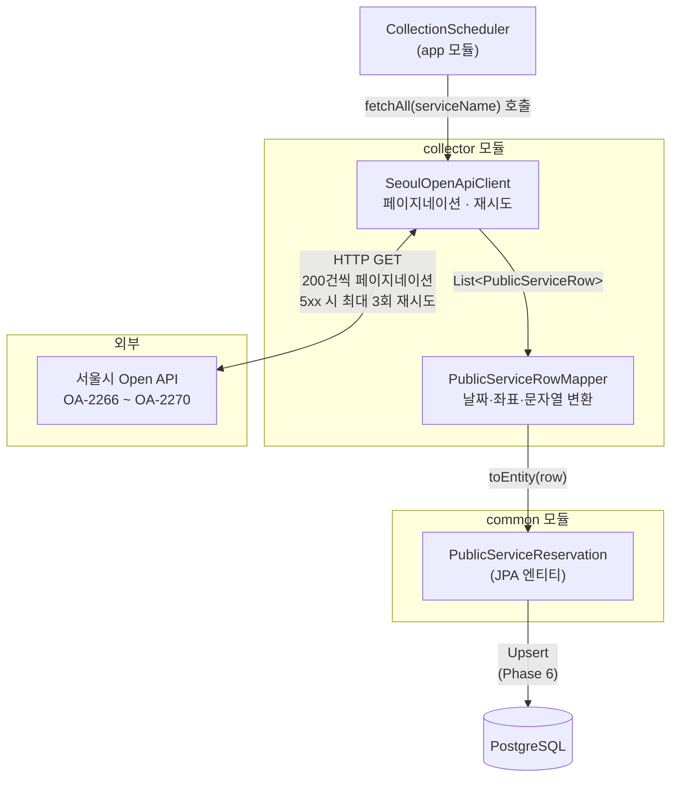

# collector 모듈

서울 열린데이터 광장 Open API에서 공공서비스 예약 데이터를 수집하고 JPA 엔티티로 변환하는 파이프라인 모듈입니다.
`app` 모듈의 스케줄러가 수집을 트리거하면, `collector`가 API 호출 → 페이지네이션 → 변환의 흐름을 처리합니다.

---

## 수집 흐름



---

## 모듈 구조

```
collector/
├── config/
│   ├── CollectorConfig.java        # WebClient Bean 등록
│   └── SeoulApiProperties.java     # seoul.api.* 설정 바인딩
├── dto/
│   ├── PublicServiceRow.java       # API 응답 row (24개 필드)
│   └── SeoulApiResponse.java       # API 응답 최상위 래퍼
├── exception/
│   ├── SeoulApiException.java      # Open API 호출 오류 기반 클래스 (4xx)
│   └── SeoulApiServerException.java# 5xx 오류 — 재시도 대상
├── PublicServiceRowMapper.java     # DTO → 엔티티 변환기
└── SeoulOpenApiClient.java         # Open API 호출 클라이언트
```

---

## 주요 컴포넌트

### SeoulOpenApiClient

서울시 Open API의 5개 서비스를 페이지네이션으로 전체 수집합니다.

- **페이지 크기**: 200건 (`seoul.api.page-size`, 기본값 200)
- **재시도**: 5xx 응답 시 지수 백오프로 최대 3회 재시도 (`SeoulApiServerException` 필터)
- **4xx 오류**: 재시도 없이 즉시 `SeoulApiException` 발생

```java
// app 모듈에서의 호출 예시
List<PublicServiceRow> rows = client.fetchAll("ListPublicReservationCulture");
```

수집 대상 서비스명:

| 카테고리 | 서비스명 | 데이터셋 ID |
|---|---|---|
| 체육시설 | `ListPublicReservationSports` | OA-2266 |
| 시설대관 | `ListPublicReservationInstitution` | OA-2267 |
| 교육 | `ListPublicReservationEducation` | OA-2268 |
| 문화행사 | `ListPublicReservationCulture` | OA-2269 |
| 진료 | `ListPublicReservationMedical` | OA-2270 |

### PublicServiceRowMapper

`PublicServiceRow` DTO를 `PublicServiceReservation` JPA 엔티티로 변환합니다.

| 변환 대상 | 처리 방식 |
|---|---|
| 날짜 (`RCPTBGNDT` 등) | `yyyy-MM-dd HH:mm:ss[.S]` 파싱. null·빈 문자열·잘못된 포맷 → `null` |
| 이용 시간 (`V_MIN`, `V_MAX`) | `HH:mm` 포맷 → `LocalTime`. null·빈 문자열 → `null` |
| 좌표 (`X`, `Y`) | 문자열 → `BigDecimal`. null·빈 문자열 → `null` (Geocoding fallback 대상) |
| 취소 기준일 (`REVSTDDAY`) | 숫자 문자열 → `Short`. 파싱 실패 → `null` |
| 문자열 필드 일반 | 앞뒤 공백 제거. 공백만 있는 문자열 → `null` |

변환 실패는 예외를 던지지 않고 `null`로 처리하며, WARN 로그를 남깁니다.

---

## 예외 계층

```
OnSeoulApiException          (common 모듈 — 전역 기반 예외)
└── SeoulApiException        (collector — Open API 오류 기반, 4xx)
    └── SeoulApiServerException  (5xx 전용, 재시도 대상)
```

`SeoulApiServerException`은 WebClient의 재시도 필터(`ex instanceof SeoulApiServerException`)로 식별하여 5xx만 선택적으로 재시도합니다. 4xx는 `SeoulApiException`으로 처리되어 재시도 없이 즉시 전파됩니다.

---

## 설정

`application.yml`에 아래 항목을 추가합니다.

```yaml
seoul:
  api:
    key: ${SEOUL_API_KEY}              # 서울 열린데이터 광장 API 키 (필수)
    base-url: http://openapi.seoul.go.kr:8088  # 기본값
    page-size: 200                     # 페이지당 수집 건수 (기본값 200)
    max-retries: 3                     # 5xx 재시도 최대 횟수 (기본값 3)
```

---

## 테스트

MockWebServer(OkHttp3)로 실제 HTTP 요청 없이 클라이언트를 검증합니다.

```bash
# collector 모듈 테스트만 실행
./gradlew :collector:test

# 전체 테스트
./gradlew test
```

테스트 커버리지:

| 대상 | 검증 항목 |
|---|---|
| `SeoulOpenApiClient` | 페이지네이션 전체 수집, 5xx 재시도 횟수, 4xx 즉시 실패, 응답 파싱 오류 |
| `PublicServiceRowMapper` | 날짜 포맷 변형, 좌표 null, 공백 문자열, 취소 기준일 파싱 |
